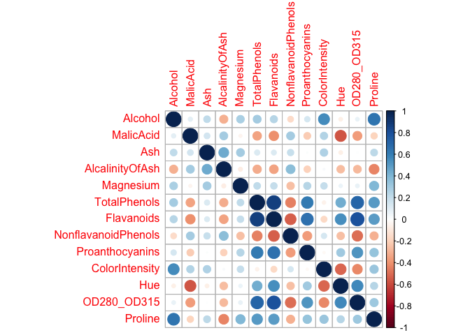
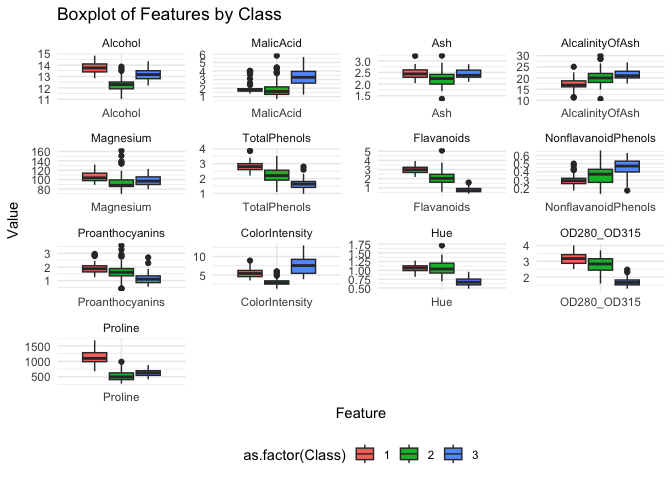
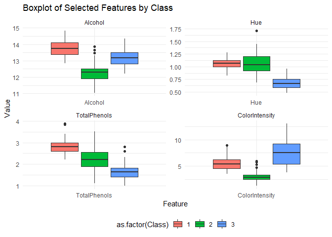
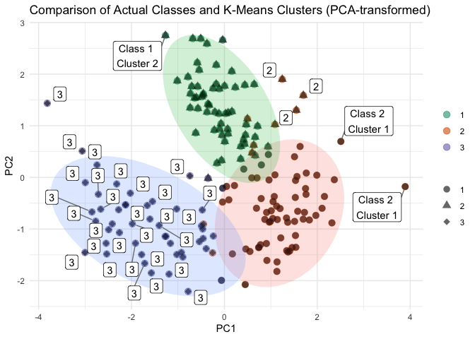

\[MA-589\] Final Project
================
Wine Statisticians - Eugene Pirono, Lance Yoon, Jason Zhu
2024-04-21

# Expectation Maximization Clustering of different Wine Types

## Introduction

Wine, a beverage celebrated for its rich diversity and intricate
flavors, serves as a fascinating subject for exploratory data analysis
and clustering due to the complex interplay of its attributes. Each
variety of wine carries a unique signature, a profile crafted by its
chemical makeup, which can be decoded using data analysis. The selection
of wine as the focus of our investigation is intentional; it is a
perfect blend of art and science, making it an exemplary candidate to
apply and illustrate machine learning techniques. By dissecting the
constituents of wine through computational lenses, we aspire to
demonstrate the potent capabilities of unsupervised learning in pattern
recognition and categorization.

## Project Overview

The project unfolds methodically, commencing with an exhaustive
exploratory data analysis (EDA) to sift through the multitude of
features inherent in wine data. This pivotal phase involves a keen
examination of the relationships between various chemical properties,
facilitated by statistical visualizations to discern the most
informative attributes. Such scrutiny allows us to distill the essence
of the dataset, cherry-picking the features that capture the essence of
wine classes most effectively. Following the EDA, we embark on the
preprocessing stage, standardizing the selected features to establish a
level playing field, thereby priming the data for clustering. The
K-Means algorithm, invoked from an R library, sets the stage as our
baseline model. This widely regarded partitioning technique provides a
robust starting point to gauge the clusters’ cohesion and separation
before delving into more sophisticated methods.

As the next step in our analytical journey, we put forth our custom
implementation of the Expectation Maximization (EM) algorithm. This
self-crafted algorithm, grounded in probability theory and linear
algebra, serves as a testament to our understanding of the underlying
statistical framework. The rigor of our EM algorithm will be evaluated
against the baseline model through a suite of metrics. These comparative
metrics are meticulously chosen not only to quantify the performance of
each model but also to illuminate the nuances between the baseline
K-Means clustering and our probabilistic EM approach. Through this
meticulous comparative analysis, we aim to uncover the subtleties and
strengths each method brings to the art of unsupervised learning in the
context of wine categorization.

``` r
df <- read.csv('data/wine_data.csv')
head(df)
```

    ##   Class Alcohol MalicAcid  Ash AlcalinityOfAsh Magnesium TotalPhenols
    ## 1     1   14.23      1.71 2.43            15.6       127         2.80
    ## 2     1   13.20      1.78 2.14            11.2       100         2.65
    ## 3     1   13.16      2.36 2.67            18.6       101         2.80
    ## 4     1   14.37      1.95 2.50            16.8       113         3.85
    ## 5     1   13.24      2.59 2.87            21.0       118         2.80
    ## 6     1   14.20      1.76 2.45            15.2       112         3.27
    ##   Flavanoids NonflavanoidPhenols Proanthocyanins ColorIntensity  Hue
    ## 1       3.06                0.28            2.29           5.64 1.04
    ## 2       2.76                0.26            1.28           4.38 1.05
    ## 3       3.24                0.30            2.81           5.68 1.03
    ## 4       3.49                0.24            2.18           7.80 0.86
    ## 5       2.69                0.39            1.82           4.32 1.04
    ## 6       3.39                0.34            1.97           6.75 1.05
    ##   OD280_OD315 Proline
    ## 1        3.92    1065
    ## 2        3.40    1050
    ## 3        3.17    1185
    ## 4        3.45    1480
    ## 5        2.93     735
    ## 6        2.85    1450

## Exploratory Data Analysis

    ## 
    ## Attaching package: 'dplyr'

    ## The following objects are masked from 'package:stats':
    ## 
    ##     filter, lag

    ## The following objects are masked from 'package:base':
    ## 
    ##     intersect, setdiff, setequal, union

    ## Registered S3 method overwritten by 'GGally':
    ##   method from   
    ##   +.gg   ggplot2

    ## corrplot 0.92 loaded

    ## 
    ## Attaching package: 'gplots'

    ## The following object is masked from 'package:stats':
    ## 
    ##     lowess

    ## 
    ## Attaching package: 'gridExtra'

    ## The following object is masked from 'package:dplyr':
    ## 
    ##     combine

    ## Package 'mclust' version 6.1
    ## Type 'citation("mclust")' for citing this R package in publications.

``` r
sum(is.na(df))
```

    ## [1] 0

``` r
cor_matrix <- cor(df[, -1]) #First column is 'class'
cor_matrix_rounded <- round(cor_matrix, 2)
corrplot(cor_matrix_rounded, method = "circle")
```

<!-- -->

<!-- -->

## Feature Selection

In the pursuit of effective clustering in wine datasets, the selection
of variables is paramount. The aim is to choose features that are
minimally correlated to each other to avoid bias in the clustering
algorithm. Highly correlated variables can distort the real distribution
and inter-relationships in the data, leading to misleading cluster
formations. Based on an in-depth analysis of domain knowledge about wine
and a detailed examination of the heatmap correlations, a strategic
decision was made on which variables to include in the clustering
process.

The reasoning behind the chosen variables and the decisions made are
summarized in the table below:

| Considerations                  | Reasoning                                                                                                                                                                                                  | Decision                                                                                                        |
|---------------------------------|------------------------------------------------------------------------------------------------------------------------------------------------------------------------------------------------------------|-----------------------------------------------------------------------------------------------------------------|
| **Alcohol vs Proline**          | Alcohol is pivotal in defining the flavor, preservation, and fermentation of wine. Proline, though important as an amino acid related to wine quality, shows a high correlation with Alcohol (0.64372004). | Choose **Alcohol** over Proline because it is more indicative of the wine type and is a primary characteristic. |
| **Malic Acid vs Hue**           | Malic Acid plays a significant role in wine but undergoes transformations during winemaking and is strongly negatively correlated with Hue (-0.56129569), a direct indicator of wine age and quality.      | Use **Hue** as it provides a direct visual representation of wine characteristics that Malic Acid does not.     |
| **Total Phenols vs Flavonoids** | Total Phenols, encompassing Flavonoids, are crucial for their impact on the wine’s bitterness, astringency, and color, with a strong correlation between them (0.8645635).                                 | Use **Total Phenols** as they cover a broader range of wine characteristics than Flavonoids alone.              |
| **Color Intensity**             | Color Intensity is less correlated with other features and provides insight into the wine’s age, grape type, and concentration.                                                                            | Include **Color Intensity** because it captures aspects of wine not represented by the other selected features. |
| **Ash**                         | Ash shows moderate correlations with several attributes and may not provide unique information for clustering.                                                                                             | Exclude **Ash** due to its less distinctive role in differentiation.                                            |
| **Magnesium**                   | Important for grapevine health and wine quality, Magnesium, however, correlates with other features and is not considered a primary characteristic for differentiation.                                    | Exclude **Magnesium** as it does not offer primary distinguishing characteristics.                              |

This selection process ensures that the clustering analysis is based on
features that provide unique and relevant information about the wines,
potentially leading to more distinct and meaningful clusters. The
choices are informed by both statistical analysis and substantive wine
knowledge, reflecting a balanced approach that leverages data-driven
insights and domain expertise.

``` r
df_selected_features <- df[, c('Class', 'Alcohol', 'Hue', 'TotalPhenols', 'ColorIntensity')]
head(df_selected_features)
```

    ##   Class Alcohol  Hue TotalPhenols ColorIntensity
    ## 1     1   14.23 1.04         2.80           5.64
    ## 2     1   13.20 1.05         2.65           4.38
    ## 3     1   13.16 1.03         2.80           5.68
    ## 4     1   14.37 0.86         3.85           7.80
    ## 5     1   13.24 1.04         2.80           4.32
    ## 6     1   14.20 1.05         3.27           6.75

``` r
df_melted <- melt(df_selected_features, id.vars = "Class")

p <- ggplot(df_melted, aes(x = variable, y = value, group = interaction(variable, Class))) +
  geom_boxplot(aes(fill = as.factor(Class))) +
  facet_wrap(~variable, scales = 'free', ncol = ) +
  labs(title = "Boxplot of Selected Features by Class", y = "Value", x = "Feature") +
  theme_minimal() +
  theme(legend.position = "bottom") 

print(p)
```

<!-- -->

## Feature Standardization

Standardization is a critical preprocessing step in clustering analysis,
particularly because most clustering algorithms, such as K-Means are
based on measuring distances between data points. When features within a
dataset vary widely in magnitudes, units, and range, algorithms that
rely on Euclidean distance can be biased towards variables with larger
scales. By standardizing the data (i.e., scaling each feature to have
zero mean and unit variance), we ensure that each feature contributes
equally to the distance computations. This prevents features with larger
ranges from dominating the decision on how data points are clustered and
allows the algorithm to identify more meaningful patterns in the data.
Moreover, standardization can improve the convergence behavior of
clustering algorithms, leading to more stable and interpretable cluster
assignments.

``` r
features_to_scale <- df_selected_features[, -1] 
scaled_features <- scale(features_to_scale)
df_scaled <- data.frame(Class = df_selected_features$Class, scaled_features)
summary(df_scaled)
```

    ##      Class          Alcohol              Hue            TotalPhenols     
    ##  Min.   :1.000   Min.   :-2.42739   Min.   :-2.08884   Min.   :-2.10132  
    ##  1st Qu.:1.000   1st Qu.:-0.78603   1st Qu.:-0.76540   1st Qu.:-0.88298  
    ##  Median :2.000   Median : 0.06083   Median : 0.03303   Median : 0.09569  
    ##  Mean   :1.938   Mean   : 0.00000   Mean   : 0.00000   Mean   : 0.00000  
    ##  3rd Qu.:3.000   3rd Qu.: 0.83378   3rd Qu.: 0.71116   3rd Qu.: 0.80672  
    ##  Max.   :3.000   Max.   : 2.25341   Max.   : 3.29241   Max.   : 2.53237  
    ##  ColorIntensity   
    ##  Min.   :-1.6297  
    ##  1st Qu.:-0.7929  
    ##  Median :-0.1588  
    ##  Mean   : 0.0000  
    ##  3rd Qu.: 0.4926  
    ##  Max.   : 3.4258

``` r
head(df_scaled)
```

    ##   Class   Alcohol        Hue TotalPhenols ColorIntensity
    ## 1     1 1.5143408  0.3611585    0.8067217      0.2510088
    ## 2     1 0.2455968  0.4049085    0.5670481     -0.2924962
    ## 3     1 0.1963252  0.3174085    0.8067217      0.2682629
    ## 4     1 1.6867914 -0.4263410    2.4844372      1.1827317
    ## 5     1 0.2948684  0.3611585    0.8067217     -0.3183774
    ## 6     1 1.4773871  0.4049085    1.5576991      0.7298108

## Baseline Algorithm - K Means Clustering

``` r
features <- df_scaled[, -1]
set.seed(589) 
kmeans_result <- kmeans(features, centers = 3, nstart = 25) 

actual_labels <- df_scaled$Class
predicted_labels <- kmeans_result$cluster
ari_value <- adjustedRandIndex(actual_labels, predicted_labels)
print(paste("Adjusted Rand Index:", ari_value))
```

    ## [1] "Adjusted Rand Index: 0.753270037486692"

``` r
sil_widths <- silhouette(predicted_labels, dist(features))
avg_silhouette_score <- mean(sil_widths[, "sil_width"])
print(paste("Average Silhouette Score:", avg_silhouette_score))
```

    ## [1] "Average Silhouette Score: 0.383979047272604"

``` r
pca_result <- prcomp(features)
df_pca <- as.data.frame(pca_result$x)
df_pca$cluster <- kmeans_result$cluster
df_pca$class <- actual_labels


ggplot(df_pca, aes(x = PC1, y = PC2)) + 
  geom_point(aes(color = as.factor(class)), size = 3, alpha = 0.6) +
  geom_point(aes(shape = as.factor(cluster)), size = 3, alpha = 0.6) +
  stat_ellipse(aes(fill = as.factor(cluster)), geom = "polygon", alpha = 0.2, show.legend = FALSE) +
  scale_color_manual(values = c("#1b9e77", "#d95f02", "#7570b3")) +
  scale_shape_manual(values = c(16, 17, 18)) +
  geom_label_repel(aes(label = ifelse(df_pca$class == df_pca$cluster, as.character(df_pca$class), paste("Class", df_pca$class, "\nCluster", df_pca$cluster))),
                   box.padding   = 0.35, 
                   point.padding = 0.5,
                   segment.color = 'grey50') +
  labs(title = 'Comparison of Actual Classes and K-Means Clusters (PCA-transformed)',
       color = "True Class",
       shape = "K-Means Cluster",
       x = 'PC1', 
       y = 'PC2') +
  theme_minimal() +
  theme(legend.position = "right", legend.title = element_blank())
```

<!-- -->

### Adjusted Rand Index (ARI)

- **High ARI Score (0.753)**: This score suggests a strong agreement
  between the clustering assignments and the true classifications of the
  wines. The ARI, being a measure of the similarity between two data
  clusterings adjusted for chance, indicates that the clusters generated
  by the K-Means algorithm align well with the actual, underlying
  groupings within the wine data. This high score implies that the
  K-Means algorithm is effective in distinguishing between different
  types of wine based on their features.

### Average Silhouette Score

- **Lower Average Silhouette Score (0.383)**: While this score is not
  exceptionally low, it is not particularly high either, suggesting
  moderate separation between the clusters. In the context of wine, this
  score implies that while the wines are grouped into distinct
  categories to some extent, there remains considerable overlap or
  closeness between these groups. This could be due to the inherent
  similarities among different types of wines, where distinguishing
  based on the analyzed features alone does not achieve clear
  separation.

### Interpretation of Clustering Performance

#### Cluster Distribution and Overlap

The high ARI combined with a lower silhouette score might indicate that
the true class boundaries are not perfectly separable by the spherical
clusters assumed by K-Means. This situation could be common in wine data
where different wine varieties (classes) may share overlapping taste
profiles, chemical compositions, or production methods.

#### Cluster Density and Size Variance

The variance in cluster densities or sizes can also influence the
silhouette score. For example, if a particular type of wine forms a very
dense cluster while others are more spread out, the average distance
within clusters compared to between clusters may decrease, leading to a
lower silhouette score.

#### Noise and Outliers

Noise and outliers in wine data, such as unusual wines or misrecorded
data points, can disproportionately affect the silhouette score more
than the ARI. This could skew the average distance calculations,
impacting the clarity of cluster boundaries.

## EM Algorithm - Gaussian Mixture Model

``` r
# EM Algorithm Function
EM_GMM <- function(features, k, max_iterations = 100, tolerance = 1e-6) {
  n <- nrow(features)
  d <- ncol(features)
  
  # Initialize parameters
  set.seed(589)
  means <- kmeans(features, centers = k, nstart = 5)$centers
  covariances <- array(rep(diag(d), k), dim = c(d, d, k))
  mixing_coefficients <- rep(1/k, k)
  
  log_likelihood_old <- -Inf
  
  # Main EM loop
  for (iteration in 1:max_iterations) {
    # E-step: Calculate responsibilities
    responsibilities <- matrix(0, nrow = n, ncol = k)
    for (j in 1:k) {
      responsibilities[, j] <- mixing_coefficients[j] * dmvnorm(features, mean = means[j, ], sigma = covariances[, , j])
    }
    responsibilities <- sweep(responsibilities, 1, rowSums(responsibilities), FUN = "/")
    
    # M-step: Update parameters
    sums_of_responsibilities <- colSums(responsibilities)
    for (j in 1:k) {
      means[j, ] <- (t(responsibilities[, j]) %*% features) / sums_of_responsibilities[j]
      centered <- sweep(features, 1, means[j, ], FUN = "-")
      covariances[, , j] <- t(centered) %*% (centered * responsibilities[, j]) / sums_of_responsibilities[j]
    }
    mixing_coefficients <- sums_of_responsibilities / n
    
    # Check for convergence via log likelihood
    log_likelihood_new <- sum(log(rowSums(responsibilities * mixing_coefficients)))
    if (abs(log_likelihood_new - log_likelihood_old) < tolerance) {
      cat("Converged after", iteration, "iterations.\n")
      break
    }
    log_likelihood_old = log_likelihood_new
  }
  
  # Return the final model parameters
  list(means = means, covariances = covariances, mixing_coefficients = mixing_coefficients)
}

# Example Usage
features <- as.matrix(df_scaled[, -ncol(df_scaled)])  # Your data here
features
```

    ##        Class     Alcohol         Hue TotalPhenols
    ##   [1,]     1  1.51434077  0.36115849  0.806721729
    ##   [2,]     1  0.24559683  0.40490846  0.567048088
    ##   [3,]     1  0.19632522  0.31740852  0.806721729
    ##   [4,]     1  1.68679140 -0.42634104  2.484437221
    ##   [5,]     1  0.29486844  0.36115849  0.806721729
    ##   [6,]     1  1.47738706  0.40490846  1.557699140
    ##   [7,]     1  1.71142720  0.27365854  0.327374446
    ##   [8,]     1  1.30493643  0.44865844  0.487156874
    ##   [9,]     1  2.25341491  0.53615839  0.806721729
    ##  [10,]     1  1.05857838  0.22990857  1.094330099
    ##  [11,]     1  1.35420804  1.27990794  1.046395371
    ##  [12,]     1  1.37884384  0.92990815 -0.151972837
    ##  [13,]     1  0.92308146  0.84240820  0.487156874
    ##  [14,]     1  2.15487169  1.27990794  1.286069013
    ##  [15,]     1  1.69910930  1.06115807  1.605633868
    ##  [16,]     1  0.77526663  1.41115786  0.886612943
    ##  [17,]     1  1.60056608  0.49240841  0.806721729
    ##  [18,]     1  1.02162467  0.75490825  1.046395371
    ##  [19,]     1  1.46506916  1.19240799  1.605633868
    ##  [20,]     1  0.78758453  0.01115870  0.646939302
    ##  [21,]     1  1.30493643  0.57990836  1.126286585
    ##  [22,]     1 -0.08698653  0.31740852  0.183570261
    ##  [23,]     1  0.87380985  0.66740831  0.503135117
    ##  [24,]     1 -0.18552975  0.57990836  0.295417961
    ##  [25,]     1  0.61513390  0.71115828  0.375309174
    ##  [26,]     1  0.06082829  0.75490825  0.535091602
    ##  [27,]     1  0.47963697 -0.16384119  0.886612943
    ##  [28,]     1  0.36877585  0.27365854  0.167592018
    ##  [29,]     1  1.07089628  1.27990794  1.046395371
    ##  [30,]     1  1.25566482  0.36115849  0.567048088
    ##  [31,]     1  0.89844565  1.01740810  1.126286585
    ##  [32,]     1  0.71367712  0.57990836  0.902591186
    ##  [33,]     1  0.83685614  1.19240799  0.199548504
    ##  [34,]     1  0.93539936  1.27990794  1.046395371
    ##  [35,]     1  0.62745180  0.62365833  0.087700804
    ##  [36,]     1  0.59049809  0.36115849  0.646939302
    ##  [37,]     1  0.34414005  0.57990836  0.487156874
    ##  [38,]     1  0.06082829  0.71115828  0.247483232
    ##  [39,]     1  0.08546410  0.97365812  0.167592018
    ##  [40,]     1  1.50202286 -0.29509111  1.126286585
    ##  [41,]     1  0.68904131 -0.03259127  1.365960227
    ##  [42,]     1  0.50427278 -0.20759117  0.247483232
    ##  [43,]     1  1.08321419 -0.33884109  1.525742654
    ##  [44,]     1  0.29486844 -0.60134093  0.551069845
    ##  [45,]     1  0.06082829 -0.33884109  1.126286585
    ##  [46,]     1  1.48970496 -0.38259106  0.886612943
    ##  [47,]     1  1.69910930  0.36115849  1.525742654
    ##  [48,]     1  1.10784999 -0.20759117  1.286069013
    ##  [49,]     1  1.35420804  0.49240841  0.726830515
    ##  [50,]     1  1.15712160  0.71115828  0.934547672
    ##  [51,]     1  0.06082829  0.71115828  0.678895787
    ##  [52,]     1  1.02162467  1.23615797  0.247483232
    ##  [53,]     1  1.00930677  0.22990857  2.532371949
    ##  [54,]     1  0.94771726  0.75490825  1.126286585
    ##  [55,]     1  0.91076355 -0.16384119  0.487156874
    ##  [56,]     1  0.68904131  0.09865865  1.062373614
    ##  [57,]     1  1.50202286 -0.07634125  1.445851440
    ##  [58,]     1  0.35645795  0.49240841  1.126286585
    ##  [59,]     1  0.88612775 -0.29509111  1.765416296
    ##  [60,]     2 -0.77678907  0.40490846 -0.503494178
    ##  [61,]     2 -0.82606067  1.27990794 -0.391646479
    ##  [62,]     2 -0.44420570  0.09865865 -0.439581207
    ##  [63,]     2  0.82453824  1.19240799 -0.311755265
    ##  [64,]     2 -0.77678907  1.14865802  1.925198724
    ##  [65,]     2 -1.02314711  2.15490741 -0.647298363
    ##  [66,]     2 -0.77678907  1.01740810  0.199548504
    ##  [67,]     2  0.13473571  0.71115828  1.094330099
    ##  [68,]     2 -0.77678907  0.71115828 -0.295777022
    ##  [69,]     2  0.41804746  0.27365854  0.375309174
    ##  [70,]     2 -0.97387550  1.41115786 -0.711211334
    ##  [71,]     2 -0.87533228 -0.22509116 -1.909579543
    ##  [72,]     2  1.05857838  1.76115765  1.046395371
    ##  [73,]     2  0.60281600  0.09865865 -0.663276606
    ##  [74,]     2 -0.01307912  1.54240778  1.605633868
    ##  [75,]     2 -1.28182306  0.14240862  1.733459810
    ##  [76,]     2 -1.65136013  1.19240799 -1.094689161
    ##  [77,]     2  0.03619249  1.01740810 -0.551428907
    ##  [78,]     2 -1.42963789  0.01115870 -0.918928490
    ##  [79,]     2 -0.82606067  0.44865844 -0.631320120
    ##  [80,]     2 -0.37029829  1.01740810  0.854656458
    ##  [81,]     2 -1.23255145  1.84865760  0.199548504
    ##  [82,]     2 -0.34566248  0.88615818 -0.151972837
    ##  [83,]     2 -1.13400823  1.54240778 -0.471537693
    ##  [84,]     2  0.06082829 -0.51384098 -1.030776190
    ##  [85,]     2 -1.42963789 -0.73259085 -0.151972837
    ##  [86,]     2 -0.40725200  1.19240799 -0.151972837
    ##  [87,]     2 -1.03546501  1.62990773 -0.823059034
    ##  [88,]     2 -1.66367803  1.76115765 -0.599363635
    ##  [89,]     2 -1.67599593  0.18615860 -0.551428907
    ##  [90,]     2 -1.13400823  0.49240841 -0.151972837
    ##  [91,]     2 -1.13400823  0.53615839 -1.110667404
    ##  [92,]     2 -1.23255145  0.40490846 -1.350341045
    ##  [93,]     2 -0.38261619  0.01115870 -1.462188745
    ##  [94,]     2 -0.87533228  0.84240820  0.247483232
    ##  [95,]     2 -1.70063174  0.88615818  1.158243070
    ##  [96,]     2 -0.65361004  0.88615818  0.327374446
    ##  [97,]     2 -1.46659160 -0.03259127 -1.110667404
    ##  [98,]     2 -0.87533228  1.19240799  0.407265660
    ##  [99,]     2 -0.77678907  0.36115849  1.957155209
    ## [100,]     2 -0.87533228  2.02365749  0.886612943
    ## [101,]     2 -1.13400823  1.36740789 -0.104038109
    ## [102,]     2 -0.49347731  0.36115849 -1.350341045
    ## [103,]     2 -0.81374277 -0.68884088  0.423243903
    ## [104,]     2 -1.45427369 -0.07634125  0.327374446
    ## [105,]     2 -0.60433843  0.36115849 -0.151972837
    ## [106,]     2 -0.71519955 -0.42634104 -0.982841462
    ## [107,]     2 -0.92460389  0.18615860 -1.030776190
    ## [108,]     2 -0.34566248 -0.33884109 -1.462188745
    ## [109,]     2 -0.96155760 -0.42634104  0.103679047
    ## [110,]     2 -1.71294964  0.01115870  0.710852273
    ## [111,]     2 -1.89771818 -0.90759075  1.413894955
    ## [112,]     2 -0.59202053 -0.25134114  0.407265660
    ## [113,]     2 -1.52818111  1.19240799 -0.870993762
    ## [114,]     2 -1.95930769  0.62365833  0.295417961
    ## [115,]     2 -1.13400823 -0.12009122  0.423243903
    ## [116,]     2 -2.42738798  3.29240673  0.263461475
    ## [117,]     2 -1.45427369 -0.03259127 -0.503494178
    ## [118,]     2 -0.71519955  0.44865844 -0.471537693
    ## [119,]     2 -0.28407297 -1.12634062 -1.062732675
    ## [120,]     2 -1.23255145 -0.12009122 -0.471537693
    ## [121,]     2 -1.91003608 -0.68884088  0.966504157
    ## [122,]     2 -1.77453915 -0.12009122  1.413894955
    ## [123,]     2 -0.71519955 -0.16384119 -0.151972837
    ## [124,]     2  0.06082829 -0.99509069  0.519113359
    ## [125,]     2 -1.39268418 -0.90759075  0.902591186
    ## [126,]     2 -1.14632613 -0.42634104  0.487156874
    ## [127,]     2 -0.70288165 -1.17009059  0.710852273
    ## [128,]     2 -1.49122740  0.05490867 -0.263820537
    ## [129,]     2 -0.77678907 -0.29509111 -0.120016352
    ## [130,]     2 -1.18327984 -0.73259085 -0.311755265
    ## [131,]     3 -0.17321185 -0.86384077 -1.254471589
    ## [132,]     3 -0.14857605 -0.95134072 -1.590014687
    ## [133,]     3 -0.23480136 -1.30134051 -1.829688329
    ## [134,]     3 -0.37029829 -0.77634083 -0.950884976
    ## [135,]     3 -0.60433843 -0.90759075 -0.471537693
    ## [136,]     3 -0.49347731 -0.99509069 -1.078710918
    ## [137,]     3 -0.92460389 -0.90759075 -1.462188745
    ## [138,]     3 -0.57970263 -0.60134093 -0.807080791
    ## [139,]     3  0.60281600 -0.64509090 -1.078710918
    ## [140,]     3 -0.19784766 -0.29509111  0.039766076
    ## [141,]     3 -0.08698653 -0.82009080 -1.206536860
    ## [142,]     3  0.44268327 -1.12634062 -1.430232259
    ## [143,]     3  0.63976970 -0.29509111 -1.190558618
    ## [144,]     3  0.76294873 -0.20759117 -0.471537693
    ## [145,]     3 -0.92460389 -1.34509048 -1.462188745
    ## [146,]     3  0.19632522 -1.56384035 -1.270449832
    ## [147,]     3  1.08321419 -1.65134030 -2.101318456
    ## [148,]     3 -0.16089395 -1.82634020 -0.950884976
    ## [149,]     3  0.39341166 -1.78259022 -0.583385392
    ## [150,]     3  0.09778200 -1.69509027 -1.414254017
    ## [151,]     3  0.61513390 -1.60759033 -1.430232259
    ## [152,]     3 -0.25943717 -2.08884004 -1.302406317
    ## [153,]     3  0.13473571 -1.52009038 -0.151972837
    ## [154,]     3  0.28255053 -1.73884025 -0.791102548
    ## [155,]     3 -0.51811312 -1.65134030 -1.302406317
    ## [156,]     3  0.20864312 -1.56384035 -0.886972005
    ## [157,]     3  1.03394258 -1.69509027 -0.791102548
    ## [158,]     3 -0.67824585 -1.25759054 -0.631320120
    ## [159,]     3  1.64983769 -1.69509027  0.806721729
    ## [160,]     3  0.59049809 -1.69509027  0.487156874
    ## [161,]     3 -0.78910697 -1.73884025  0.007809591
    ## [162,]     3  0.84917404  0.01115870 -0.743167820
    ## [163,]     3 -0.18552975 -0.38259106 -1.030776190
    ## [164,]     3 -0.05003283 -1.21384056 -1.446210502
    ## [165,]     3  0.96003516 -1.12634062 -1.510123473
    ## [166,]     3  0.89844565 -0.77634083 -1.621971173
    ## [167,]     3  0.55354439 -0.47009101 -0.950884976
    ## [168,]     3 -0.22248346 -1.03884067 -1.302406317
    ## [169,]     3  0.71367712 -0.95134072 -1.190558618
    ## [170,]     3  0.49195487 -1.25759054 -0.503494178
    ## [171,]     3 -0.98619340 -1.30134051 -1.669905901
    ## [172,]     3 -0.28407297 -1.69509027 -1.446210502
    ## [173,]     3  1.42811545 -1.47634041 -0.982841462
    ## [174,]     3  0.87380985 -1.38884046 -0.982841462
    ## [175,]     3  0.49195487 -1.12634062 -0.791102548
    ## [176,]     3  0.33182214 -1.60759033 -1.126645647
    ## [177,]     3  0.20864312 -1.56384035 -1.030776190
    ## [178,]     3  1.39116174 -1.52009038 -0.391646479

``` r
result <- EM_GMM(features, k = 3)
```

    ## Warning in sweep(features, 1, means[j, ], FUN = "-"): STATS does not recycle
    ## exactly across MARGIN

    ## Warning in sweep(features, 1, means[j, ], FUN = "-"): STATS does not recycle
    ## exactly across MARGIN

    ## Warning in sweep(features, 1, means[j, ], FUN = "-"): STATS does not recycle
    ## exactly across MARGIN

    ## Warning in sweep(features, 1, means[j, ], FUN = "-"): STATS does not recycle
    ## exactly across MARGIN

    ## Warning in sweep(features, 1, means[j, ], FUN = "-"): STATS does not recycle
    ## exactly across MARGIN

    ## Warning in sweep(features, 1, means[j, ], FUN = "-"): STATS does not recycle
    ## exactly across MARGIN

    ## Warning in sweep(features, 1, means[j, ], FUN = "-"): STATS does not recycle
    ## exactly across MARGIN

    ## Warning in sweep(features, 1, means[j, ], FUN = "-"): STATS does not recycle
    ## exactly across MARGIN

    ## Warning in sweep(features, 1, means[j, ], FUN = "-"): STATS does not recycle
    ## exactly across MARGIN

    ## Warning in sweep(features, 1, means[j, ], FUN = "-"): STATS does not recycle
    ## exactly across MARGIN

    ## Warning in sweep(features, 1, means[j, ], FUN = "-"): STATS does not recycle
    ## exactly across MARGIN

    ## Warning in sweep(features, 1, means[j, ], FUN = "-"): STATS does not recycle
    ## exactly across MARGIN

    ## Warning in sweep(features, 1, means[j, ], FUN = "-"): STATS does not recycle
    ## exactly across MARGIN

    ## Warning in sweep(features, 1, means[j, ], FUN = "-"): STATS does not recycle
    ## exactly across MARGIN

    ## Warning in sweep(features, 1, means[j, ], FUN = "-"): STATS does not recycle
    ## exactly across MARGIN

    ## Warning in sweep(features, 1, means[j, ], FUN = "-"): STATS does not recycle
    ## exactly across MARGIN

    ## Warning in sweep(features, 1, means[j, ], FUN = "-"): STATS does not recycle
    ## exactly across MARGIN

    ## Warning in sweep(features, 1, means[j, ], FUN = "-"): STATS does not recycle
    ## exactly across MARGIN

    ## Warning in sweep(features, 1, means[j, ], FUN = "-"): STATS does not recycle
    ## exactly across MARGIN

    ## Warning in sweep(features, 1, means[j, ], FUN = "-"): STATS does not recycle
    ## exactly across MARGIN

    ## Warning in sweep(features, 1, means[j, ], FUN = "-"): STATS does not recycle
    ## exactly across MARGIN

    ## Warning in sweep(features, 1, means[j, ], FUN = "-"): STATS does not recycle
    ## exactly across MARGIN

    ## Warning in sweep(features, 1, means[j, ], FUN = "-"): STATS does not recycle
    ## exactly across MARGIN

    ## Warning in sweep(features, 1, means[j, ], FUN = "-"): STATS does not recycle
    ## exactly across MARGIN

    ## Warning in sweep(features, 1, means[j, ], FUN = "-"): STATS does not recycle
    ## exactly across MARGIN

    ## Warning in sweep(features, 1, means[j, ], FUN = "-"): STATS does not recycle
    ## exactly across MARGIN

    ## Warning in sweep(features, 1, means[j, ], FUN = "-"): STATS does not recycle
    ## exactly across MARGIN

    ## Warning in sweep(features, 1, means[j, ], FUN = "-"): STATS does not recycle
    ## exactly across MARGIN

    ## Warning in sweep(features, 1, means[j, ], FUN = "-"): STATS does not recycle
    ## exactly across MARGIN

    ## Warning in sweep(features, 1, means[j, ], FUN = "-"): STATS does not recycle
    ## exactly across MARGIN

    ## Warning in sweep(features, 1, means[j, ], FUN = "-"): STATS does not recycle
    ## exactly across MARGIN

    ## Warning in sweep(features, 1, means[j, ], FUN = "-"): STATS does not recycle
    ## exactly across MARGIN

    ## Warning in sweep(features, 1, means[j, ], FUN = "-"): STATS does not recycle
    ## exactly across MARGIN

    ## Warning in sweep(features, 1, means[j, ], FUN = "-"): STATS does not recycle
    ## exactly across MARGIN

    ## Warning in sweep(features, 1, means[j, ], FUN = "-"): STATS does not recycle
    ## exactly across MARGIN

    ## Warning in sweep(features, 1, means[j, ], FUN = "-"): STATS does not recycle
    ## exactly across MARGIN

    ## Warning in sweep(features, 1, means[j, ], FUN = "-"): STATS does not recycle
    ## exactly across MARGIN

    ## Warning in sweep(features, 1, means[j, ], FUN = "-"): STATS does not recycle
    ## exactly across MARGIN

    ## Warning in sweep(features, 1, means[j, ], FUN = "-"): STATS does not recycle
    ## exactly across MARGIN

    ## Warning in sweep(features, 1, means[j, ], FUN = "-"): STATS does not recycle
    ## exactly across MARGIN

    ## Warning in sweep(features, 1, means[j, ], FUN = "-"): STATS does not recycle
    ## exactly across MARGIN

    ## Warning in sweep(features, 1, means[j, ], FUN = "-"): STATS does not recycle
    ## exactly across MARGIN

    ## Warning in sweep(features, 1, means[j, ], FUN = "-"): STATS does not recycle
    ## exactly across MARGIN

    ## Warning in sweep(features, 1, means[j, ], FUN = "-"): STATS does not recycle
    ## exactly across MARGIN

    ## Warning in sweep(features, 1, means[j, ], FUN = "-"): STATS does not recycle
    ## exactly across MARGIN

    ## Warning in sweep(features, 1, means[j, ], FUN = "-"): STATS does not recycle
    ## exactly across MARGIN

    ## Warning in sweep(features, 1, means[j, ], FUN = "-"): STATS does not recycle
    ## exactly across MARGIN

    ## Warning in sweep(features, 1, means[j, ], FUN = "-"): STATS does not recycle
    ## exactly across MARGIN

    ## Warning in sweep(features, 1, means[j, ], FUN = "-"): STATS does not recycle
    ## exactly across MARGIN

    ## Warning in sweep(features, 1, means[j, ], FUN = "-"): STATS does not recycle
    ## exactly across MARGIN

    ## Warning in sweep(features, 1, means[j, ], FUN = "-"): STATS does not recycle
    ## exactly across MARGIN

    ## Warning in sweep(features, 1, means[j, ], FUN = "-"): STATS does not recycle
    ## exactly across MARGIN

    ## Warning in sweep(features, 1, means[j, ], FUN = "-"): STATS does not recycle
    ## exactly across MARGIN

    ## Warning in sweep(features, 1, means[j, ], FUN = "-"): STATS does not recycle
    ## exactly across MARGIN

    ## Warning in sweep(features, 1, means[j, ], FUN = "-"): STATS does not recycle
    ## exactly across MARGIN

    ## Warning in sweep(features, 1, means[j, ], FUN = "-"): STATS does not recycle
    ## exactly across MARGIN

    ## Warning in sweep(features, 1, means[j, ], FUN = "-"): STATS does not recycle
    ## exactly across MARGIN

    ## Warning in sweep(features, 1, means[j, ], FUN = "-"): STATS does not recycle
    ## exactly across MARGIN

    ## Warning in sweep(features, 1, means[j, ], FUN = "-"): STATS does not recycle
    ## exactly across MARGIN

    ## Warning in sweep(features, 1, means[j, ], FUN = "-"): STATS does not recycle
    ## exactly across MARGIN

    ## Warning in sweep(features, 1, means[j, ], FUN = "-"): STATS does not recycle
    ## exactly across MARGIN

    ## Warning in sweep(features, 1, means[j, ], FUN = "-"): STATS does not recycle
    ## exactly across MARGIN

    ## Warning in sweep(features, 1, means[j, ], FUN = "-"): STATS does not recycle
    ## exactly across MARGIN

    ## Warning in sweep(features, 1, means[j, ], FUN = "-"): STATS does not recycle
    ## exactly across MARGIN

    ## Warning in sweep(features, 1, means[j, ], FUN = "-"): STATS does not recycle
    ## exactly across MARGIN

    ## Warning in sweep(features, 1, means[j, ], FUN = "-"): STATS does not recycle
    ## exactly across MARGIN

    ## Warning in sweep(features, 1, means[j, ], FUN = "-"): STATS does not recycle
    ## exactly across MARGIN

    ## Warning in sweep(features, 1, means[j, ], FUN = "-"): STATS does not recycle
    ## exactly across MARGIN

    ## Warning in sweep(features, 1, means[j, ], FUN = "-"): STATS does not recycle
    ## exactly across MARGIN

    ## Warning in sweep(features, 1, means[j, ], FUN = "-"): STATS does not recycle
    ## exactly across MARGIN

    ## Warning in sweep(features, 1, means[j, ], FUN = "-"): STATS does not recycle
    ## exactly across MARGIN

    ## Warning in sweep(features, 1, means[j, ], FUN = "-"): STATS does not recycle
    ## exactly across MARGIN

    ## Warning in sweep(features, 1, means[j, ], FUN = "-"): STATS does not recycle
    ## exactly across MARGIN

    ## Warning in sweep(features, 1, means[j, ], FUN = "-"): STATS does not recycle
    ## exactly across MARGIN

    ## Warning in sweep(features, 1, means[j, ], FUN = "-"): STATS does not recycle
    ## exactly across MARGIN

    ## Warning in sweep(features, 1, means[j, ], FUN = "-"): STATS does not recycle
    ## exactly across MARGIN

    ## Warning in sweep(features, 1, means[j, ], FUN = "-"): STATS does not recycle
    ## exactly across MARGIN

    ## Warning in sweep(features, 1, means[j, ], FUN = "-"): STATS does not recycle
    ## exactly across MARGIN

    ## Warning in sweep(features, 1, means[j, ], FUN = "-"): STATS does not recycle
    ## exactly across MARGIN

    ## Warning in sweep(features, 1, means[j, ], FUN = "-"): STATS does not recycle
    ## exactly across MARGIN

    ## Warning in sweep(features, 1, means[j, ], FUN = "-"): STATS does not recycle
    ## exactly across MARGIN

    ## Warning in sweep(features, 1, means[j, ], FUN = "-"): STATS does not recycle
    ## exactly across MARGIN

    ## Warning in sweep(features, 1, means[j, ], FUN = "-"): STATS does not recycle
    ## exactly across MARGIN

    ## Warning in sweep(features, 1, means[j, ], FUN = "-"): STATS does not recycle
    ## exactly across MARGIN

    ## Warning in sweep(features, 1, means[j, ], FUN = "-"): STATS does not recycle
    ## exactly across MARGIN

    ## Warning in sweep(features, 1, means[j, ], FUN = "-"): STATS does not recycle
    ## exactly across MARGIN

    ## Warning in sweep(features, 1, means[j, ], FUN = "-"): STATS does not recycle
    ## exactly across MARGIN

    ## Warning in sweep(features, 1, means[j, ], FUN = "-"): STATS does not recycle
    ## exactly across MARGIN

    ## Warning in sweep(features, 1, means[j, ], FUN = "-"): STATS does not recycle
    ## exactly across MARGIN

    ## Warning in sweep(features, 1, means[j, ], FUN = "-"): STATS does not recycle
    ## exactly across MARGIN

    ## Warning in sweep(features, 1, means[j, ], FUN = "-"): STATS does not recycle
    ## exactly across MARGIN

    ## Warning in sweep(features, 1, means[j, ], FUN = "-"): STATS does not recycle
    ## exactly across MARGIN

    ## Warning in sweep(features, 1, means[j, ], FUN = "-"): STATS does not recycle
    ## exactly across MARGIN

    ## Warning in sweep(features, 1, means[j, ], FUN = "-"): STATS does not recycle
    ## exactly across MARGIN

    ## Warning in sweep(features, 1, means[j, ], FUN = "-"): STATS does not recycle
    ## exactly across MARGIN

    ## Warning in sweep(features, 1, means[j, ], FUN = "-"): STATS does not recycle
    ## exactly across MARGIN

    ## Warning in sweep(features, 1, means[j, ], FUN = "-"): STATS does not recycle
    ## exactly across MARGIN

    ## Warning in sweep(features, 1, means[j, ], FUN = "-"): STATS does not recycle
    ## exactly across MARGIN

    ## Warning in sweep(features, 1, means[j, ], FUN = "-"): STATS does not recycle
    ## exactly across MARGIN

    ## Warning in sweep(features, 1, means[j, ], FUN = "-"): STATS does not recycle
    ## exactly across MARGIN

    ## Warning in sweep(features, 1, means[j, ], FUN = "-"): STATS does not recycle
    ## exactly across MARGIN

    ## Warning in sweep(features, 1, means[j, ], FUN = "-"): STATS does not recycle
    ## exactly across MARGIN

    ## Warning in sweep(features, 1, means[j, ], FUN = "-"): STATS does not recycle
    ## exactly across MARGIN

    ## Warning in sweep(features, 1, means[j, ], FUN = "-"): STATS does not recycle
    ## exactly across MARGIN

    ## Warning in sweep(features, 1, means[j, ], FUN = "-"): STATS does not recycle
    ## exactly across MARGIN

    ## Warning in sweep(features, 1, means[j, ], FUN = "-"): STATS does not recycle
    ## exactly across MARGIN

    ## Warning in sweep(features, 1, means[j, ], FUN = "-"): STATS does not recycle
    ## exactly across MARGIN

    ## Warning in sweep(features, 1, means[j, ], FUN = "-"): STATS does not recycle
    ## exactly across MARGIN

    ## Warning in sweep(features, 1, means[j, ], FUN = "-"): STATS does not recycle
    ## exactly across MARGIN

    ## Warning in sweep(features, 1, means[j, ], FUN = "-"): STATS does not recycle
    ## exactly across MARGIN

    ## Warning in sweep(features, 1, means[j, ], FUN = "-"): STATS does not recycle
    ## exactly across MARGIN

    ## Warning in sweep(features, 1, means[j, ], FUN = "-"): STATS does not recycle
    ## exactly across MARGIN

    ## Warning in sweep(features, 1, means[j, ], FUN = "-"): STATS does not recycle
    ## exactly across MARGIN

    ## Warning in sweep(features, 1, means[j, ], FUN = "-"): STATS does not recycle
    ## exactly across MARGIN

    ## Warning in sweep(features, 1, means[j, ], FUN = "-"): STATS does not recycle
    ## exactly across MARGIN

    ## Warning in sweep(features, 1, means[j, ], FUN = "-"): STATS does not recycle
    ## exactly across MARGIN

    ## Warning in sweep(features, 1, means[j, ], FUN = "-"): STATS does not recycle
    ## exactly across MARGIN

    ## Warning in sweep(features, 1, means[j, ], FUN = "-"): STATS does not recycle
    ## exactly across MARGIN

    ## Warning in sweep(features, 1, means[j, ], FUN = "-"): STATS does not recycle
    ## exactly across MARGIN

    ## Warning in sweep(features, 1, means[j, ], FUN = "-"): STATS does not recycle
    ## exactly across MARGIN

    ## Warning in sweep(features, 1, means[j, ], FUN = "-"): STATS does not recycle
    ## exactly across MARGIN

    ## Warning in sweep(features, 1, means[j, ], FUN = "-"): STATS does not recycle
    ## exactly across MARGIN

    ## Warning in sweep(features, 1, means[j, ], FUN = "-"): STATS does not recycle
    ## exactly across MARGIN

    ## Warning in sweep(features, 1, means[j, ], FUN = "-"): STATS does not recycle
    ## exactly across MARGIN

    ## Warning in sweep(features, 1, means[j, ], FUN = "-"): STATS does not recycle
    ## exactly across MARGIN

    ## Warning in sweep(features, 1, means[j, ], FUN = "-"): STATS does not recycle
    ## exactly across MARGIN

    ## Warning in sweep(features, 1, means[j, ], FUN = "-"): STATS does not recycle
    ## exactly across MARGIN

    ## Warning in sweep(features, 1, means[j, ], FUN = "-"): STATS does not recycle
    ## exactly across MARGIN

    ## Warning in sweep(features, 1, means[j, ], FUN = "-"): STATS does not recycle
    ## exactly across MARGIN

    ## Warning in sweep(features, 1, means[j, ], FUN = "-"): STATS does not recycle
    ## exactly across MARGIN

    ## Warning in sweep(features, 1, means[j, ], FUN = "-"): STATS does not recycle
    ## exactly across MARGIN

    ## Warning in sweep(features, 1, means[j, ], FUN = "-"): STATS does not recycle
    ## exactly across MARGIN

    ## Warning in sweep(features, 1, means[j, ], FUN = "-"): STATS does not recycle
    ## exactly across MARGIN

    ## Warning in sweep(features, 1, means[j, ], FUN = "-"): STATS does not recycle
    ## exactly across MARGIN

    ## Warning in sweep(features, 1, means[j, ], FUN = "-"): STATS does not recycle
    ## exactly across MARGIN

    ## Warning in sweep(features, 1, means[j, ], FUN = "-"): STATS does not recycle
    ## exactly across MARGIN

    ## Warning in sweep(features, 1, means[j, ], FUN = "-"): STATS does not recycle
    ## exactly across MARGIN

    ## Warning in sweep(features, 1, means[j, ], FUN = "-"): STATS does not recycle
    ## exactly across MARGIN

    ## Warning in sweep(features, 1, means[j, ], FUN = "-"): STATS does not recycle
    ## exactly across MARGIN

    ## Warning in sweep(features, 1, means[j, ], FUN = "-"): STATS does not recycle
    ## exactly across MARGIN

    ## Warning in sweep(features, 1, means[j, ], FUN = "-"): STATS does not recycle
    ## exactly across MARGIN

    ## Warning in sweep(features, 1, means[j, ], FUN = "-"): STATS does not recycle
    ## exactly across MARGIN

    ## Warning in sweep(features, 1, means[j, ], FUN = "-"): STATS does not recycle
    ## exactly across MARGIN

    ## Warning in sweep(features, 1, means[j, ], FUN = "-"): STATS does not recycle
    ## exactly across MARGIN

    ## Warning in sweep(features, 1, means[j, ], FUN = "-"): STATS does not recycle
    ## exactly across MARGIN

    ## Warning in sweep(features, 1, means[j, ], FUN = "-"): STATS does not recycle
    ## exactly across MARGIN

    ## Warning in sweep(features, 1, means[j, ], FUN = "-"): STATS does not recycle
    ## exactly across MARGIN

    ## Warning in sweep(features, 1, means[j, ], FUN = "-"): STATS does not recycle
    ## exactly across MARGIN

    ## Warning in sweep(features, 1, means[j, ], FUN = "-"): STATS does not recycle
    ## exactly across MARGIN

    ## Warning in sweep(features, 1, means[j, ], FUN = "-"): STATS does not recycle
    ## exactly across MARGIN

    ## Warning in sweep(features, 1, means[j, ], FUN = "-"): STATS does not recycle
    ## exactly across MARGIN

    ## Warning in sweep(features, 1, means[j, ], FUN = "-"): STATS does not recycle
    ## exactly across MARGIN

    ## Warning in sweep(features, 1, means[j, ], FUN = "-"): STATS does not recycle
    ## exactly across MARGIN

    ## Warning in sweep(features, 1, means[j, ], FUN = "-"): STATS does not recycle
    ## exactly across MARGIN

    ## Warning in sweep(features, 1, means[j, ], FUN = "-"): STATS does not recycle
    ## exactly across MARGIN

    ## Warning in sweep(features, 1, means[j, ], FUN = "-"): STATS does not recycle
    ## exactly across MARGIN

    ## Warning in sweep(features, 1, means[j, ], FUN = "-"): STATS does not recycle
    ## exactly across MARGIN

    ## Warning in sweep(features, 1, means[j, ], FUN = "-"): STATS does not recycle
    ## exactly across MARGIN

    ## Warning in sweep(features, 1, means[j, ], FUN = "-"): STATS does not recycle
    ## exactly across MARGIN

    ## Warning in sweep(features, 1, means[j, ], FUN = "-"): STATS does not recycle
    ## exactly across MARGIN

    ## Warning in sweep(features, 1, means[j, ], FUN = "-"): STATS does not recycle
    ## exactly across MARGIN

    ## Warning in sweep(features, 1, means[j, ], FUN = "-"): STATS does not recycle
    ## exactly across MARGIN

    ## Warning in sweep(features, 1, means[j, ], FUN = "-"): STATS does not recycle
    ## exactly across MARGIN

    ## Warning in sweep(features, 1, means[j, ], FUN = "-"): STATS does not recycle
    ## exactly across MARGIN

    ## Warning in sweep(features, 1, means[j, ], FUN = "-"): STATS does not recycle
    ## exactly across MARGIN

    ## Warning in sweep(features, 1, means[j, ], FUN = "-"): STATS does not recycle
    ## exactly across MARGIN

    ## Warning in sweep(features, 1, means[j, ], FUN = "-"): STATS does not recycle
    ## exactly across MARGIN

    ## Warning in sweep(features, 1, means[j, ], FUN = "-"): STATS does not recycle
    ## exactly across MARGIN

    ## Warning in sweep(features, 1, means[j, ], FUN = "-"): STATS does not recycle
    ## exactly across MARGIN

    ## Warning in sweep(features, 1, means[j, ], FUN = "-"): STATS does not recycle
    ## exactly across MARGIN

    ## Warning in sweep(features, 1, means[j, ], FUN = "-"): STATS does not recycle
    ## exactly across MARGIN

    ## Warning in sweep(features, 1, means[j, ], FUN = "-"): STATS does not recycle
    ## exactly across MARGIN

    ## Warning in sweep(features, 1, means[j, ], FUN = "-"): STATS does not recycle
    ## exactly across MARGIN

    ## Warning in sweep(features, 1, means[j, ], FUN = "-"): STATS does not recycle
    ## exactly across MARGIN

    ## Warning in sweep(features, 1, means[j, ], FUN = "-"): STATS does not recycle
    ## exactly across MARGIN

    ## Warning in sweep(features, 1, means[j, ], FUN = "-"): STATS does not recycle
    ## exactly across MARGIN

    ## Warning in sweep(features, 1, means[j, ], FUN = "-"): STATS does not recycle
    ## exactly across MARGIN

    ## Warning in sweep(features, 1, means[j, ], FUN = "-"): STATS does not recycle
    ## exactly across MARGIN

    ## Warning in sweep(features, 1, means[j, ], FUN = "-"): STATS does not recycle
    ## exactly across MARGIN

    ## Warning in sweep(features, 1, means[j, ], FUN = "-"): STATS does not recycle
    ## exactly across MARGIN

    ## Warning in sweep(features, 1, means[j, ], FUN = "-"): STATS does not recycle
    ## exactly across MARGIN

    ## Warning in sweep(features, 1, means[j, ], FUN = "-"): STATS does not recycle
    ## exactly across MARGIN

    ## Warning in sweep(features, 1, means[j, ], FUN = "-"): STATS does not recycle
    ## exactly across MARGIN

    ## Warning in sweep(features, 1, means[j, ], FUN = "-"): STATS does not recycle
    ## exactly across MARGIN

    ## Warning in sweep(features, 1, means[j, ], FUN = "-"): STATS does not recycle
    ## exactly across MARGIN

    ## Warning in sweep(features, 1, means[j, ], FUN = "-"): STATS does not recycle
    ## exactly across MARGIN

    ## Warning in sweep(features, 1, means[j, ], FUN = "-"): STATS does not recycle
    ## exactly across MARGIN

    ## Warning in sweep(features, 1, means[j, ], FUN = "-"): STATS does not recycle
    ## exactly across MARGIN

    ## Warning in sweep(features, 1, means[j, ], FUN = "-"): STATS does not recycle
    ## exactly across MARGIN

    ## Warning in sweep(features, 1, means[j, ], FUN = "-"): STATS does not recycle
    ## exactly across MARGIN

    ## Warning in sweep(features, 1, means[j, ], FUN = "-"): STATS does not recycle
    ## exactly across MARGIN

    ## Warning in sweep(features, 1, means[j, ], FUN = "-"): STATS does not recycle
    ## exactly across MARGIN

    ## Warning in sweep(features, 1, means[j, ], FUN = "-"): STATS does not recycle
    ## exactly across MARGIN

    ## Warning in sweep(features, 1, means[j, ], FUN = "-"): STATS does not recycle
    ## exactly across MARGIN

    ## Warning in sweep(features, 1, means[j, ], FUN = "-"): STATS does not recycle
    ## exactly across MARGIN

    ## Warning in sweep(features, 1, means[j, ], FUN = "-"): STATS does not recycle
    ## exactly across MARGIN

    ## Warning in sweep(features, 1, means[j, ], FUN = "-"): STATS does not recycle
    ## exactly across MARGIN

    ## Warning in sweep(features, 1, means[j, ], FUN = "-"): STATS does not recycle
    ## exactly across MARGIN

    ## Warning in sweep(features, 1, means[j, ], FUN = "-"): STATS does not recycle
    ## exactly across MARGIN

    ## Warning in sweep(features, 1, means[j, ], FUN = "-"): STATS does not recycle
    ## exactly across MARGIN

    ## Warning in sweep(features, 1, means[j, ], FUN = "-"): STATS does not recycle
    ## exactly across MARGIN

    ## Warning in sweep(features, 1, means[j, ], FUN = "-"): STATS does not recycle
    ## exactly across MARGIN

    ## Warning in sweep(features, 1, means[j, ], FUN = "-"): STATS does not recycle
    ## exactly across MARGIN

    ## Warning in sweep(features, 1, means[j, ], FUN = "-"): STATS does not recycle
    ## exactly across MARGIN

    ## Warning in sweep(features, 1, means[j, ], FUN = "-"): STATS does not recycle
    ## exactly across MARGIN

    ## Warning in sweep(features, 1, means[j, ], FUN = "-"): STATS does not recycle
    ## exactly across MARGIN

    ## Warning in sweep(features, 1, means[j, ], FUN = "-"): STATS does not recycle
    ## exactly across MARGIN

    ## Warning in sweep(features, 1, means[j, ], FUN = "-"): STATS does not recycle
    ## exactly across MARGIN

    ## Warning in sweep(features, 1, means[j, ], FUN = "-"): STATS does not recycle
    ## exactly across MARGIN

    ## Warning in sweep(features, 1, means[j, ], FUN = "-"): STATS does not recycle
    ## exactly across MARGIN

    ## Warning in sweep(features, 1, means[j, ], FUN = "-"): STATS does not recycle
    ## exactly across MARGIN

    ## Warning in sweep(features, 1, means[j, ], FUN = "-"): STATS does not recycle
    ## exactly across MARGIN

    ## Warning in sweep(features, 1, means[j, ], FUN = "-"): STATS does not recycle
    ## exactly across MARGIN

    ## Warning in sweep(features, 1, means[j, ], FUN = "-"): STATS does not recycle
    ## exactly across MARGIN

    ## Warning in sweep(features, 1, means[j, ], FUN = "-"): STATS does not recycle
    ## exactly across MARGIN

    ## Warning in sweep(features, 1, means[j, ], FUN = "-"): STATS does not recycle
    ## exactly across MARGIN

    ## Warning in sweep(features, 1, means[j, ], FUN = "-"): STATS does not recycle
    ## exactly across MARGIN

    ## Warning in sweep(features, 1, means[j, ], FUN = "-"): STATS does not recycle
    ## exactly across MARGIN

    ## Warning in sweep(features, 1, means[j, ], FUN = "-"): STATS does not recycle
    ## exactly across MARGIN

    ## Warning in sweep(features, 1, means[j, ], FUN = "-"): STATS does not recycle
    ## exactly across MARGIN

    ## Warning in sweep(features, 1, means[j, ], FUN = "-"): STATS does not recycle
    ## exactly across MARGIN

    ## Warning in sweep(features, 1, means[j, ], FUN = "-"): STATS does not recycle
    ## exactly across MARGIN

    ## Warning in sweep(features, 1, means[j, ], FUN = "-"): STATS does not recycle
    ## exactly across MARGIN

    ## Warning in sweep(features, 1, means[j, ], FUN = "-"): STATS does not recycle
    ## exactly across MARGIN

    ## Warning in sweep(features, 1, means[j, ], FUN = "-"): STATS does not recycle
    ## exactly across MARGIN

    ## Warning in sweep(features, 1, means[j, ], FUN = "-"): STATS does not recycle
    ## exactly across MARGIN

    ## Warning in sweep(features, 1, means[j, ], FUN = "-"): STATS does not recycle
    ## exactly across MARGIN

    ## Warning in sweep(features, 1, means[j, ], FUN = "-"): STATS does not recycle
    ## exactly across MARGIN

    ## Warning in sweep(features, 1, means[j, ], FUN = "-"): STATS does not recycle
    ## exactly across MARGIN

    ## Warning in sweep(features, 1, means[j, ], FUN = "-"): STATS does not recycle
    ## exactly across MARGIN

    ## Warning in sweep(features, 1, means[j, ], FUN = "-"): STATS does not recycle
    ## exactly across MARGIN

    ## Warning in sweep(features, 1, means[j, ], FUN = "-"): STATS does not recycle
    ## exactly across MARGIN

    ## Warning in sweep(features, 1, means[j, ], FUN = "-"): STATS does not recycle
    ## exactly across MARGIN

    ## Warning in sweep(features, 1, means[j, ], FUN = "-"): STATS does not recycle
    ## exactly across MARGIN

    ## Warning in sweep(features, 1, means[j, ], FUN = "-"): STATS does not recycle
    ## exactly across MARGIN

    ## Warning in sweep(features, 1, means[j, ], FUN = "-"): STATS does not recycle
    ## exactly across MARGIN

    ## Warning in sweep(features, 1, means[j, ], FUN = "-"): STATS does not recycle
    ## exactly across MARGIN

    ## Warning in sweep(features, 1, means[j, ], FUN = "-"): STATS does not recycle
    ## exactly across MARGIN

    ## Warning in sweep(features, 1, means[j, ], FUN = "-"): STATS does not recycle
    ## exactly across MARGIN

    ## Warning in sweep(features, 1, means[j, ], FUN = "-"): STATS does not recycle
    ## exactly across MARGIN

    ## Warning in sweep(features, 1, means[j, ], FUN = "-"): STATS does not recycle
    ## exactly across MARGIN

    ## Warning in sweep(features, 1, means[j, ], FUN = "-"): STATS does not recycle
    ## exactly across MARGIN

    ## Warning in sweep(features, 1, means[j, ], FUN = "-"): STATS does not recycle
    ## exactly across MARGIN

    ## Warning in sweep(features, 1, means[j, ], FUN = "-"): STATS does not recycle
    ## exactly across MARGIN

    ## Warning in sweep(features, 1, means[j, ], FUN = "-"): STATS does not recycle
    ## exactly across MARGIN

    ## Warning in sweep(features, 1, means[j, ], FUN = "-"): STATS does not recycle
    ## exactly across MARGIN

    ## Warning in sweep(features, 1, means[j, ], FUN = "-"): STATS does not recycle
    ## exactly across MARGIN

    ## Warning in sweep(features, 1, means[j, ], FUN = "-"): STATS does not recycle
    ## exactly across MARGIN

    ## Warning in sweep(features, 1, means[j, ], FUN = "-"): STATS does not recycle
    ## exactly across MARGIN

    ## Warning in sweep(features, 1, means[j, ], FUN = "-"): STATS does not recycle
    ## exactly across MARGIN

    ## Warning in sweep(features, 1, means[j, ], FUN = "-"): STATS does not recycle
    ## exactly across MARGIN

    ## Warning in sweep(features, 1, means[j, ], FUN = "-"): STATS does not recycle
    ## exactly across MARGIN

    ## Warning in sweep(features, 1, means[j, ], FUN = "-"): STATS does not recycle
    ## exactly across MARGIN

    ## Warning in sweep(features, 1, means[j, ], FUN = "-"): STATS does not recycle
    ## exactly across MARGIN

    ## Warning in sweep(features, 1, means[j, ], FUN = "-"): STATS does not recycle
    ## exactly across MARGIN

    ## Warning in sweep(features, 1, means[j, ], FUN = "-"): STATS does not recycle
    ## exactly across MARGIN

    ## Warning in sweep(features, 1, means[j, ], FUN = "-"): STATS does not recycle
    ## exactly across MARGIN

    ## Warning in sweep(features, 1, means[j, ], FUN = "-"): STATS does not recycle
    ## exactly across MARGIN

    ## Warning in sweep(features, 1, means[j, ], FUN = "-"): STATS does not recycle
    ## exactly across MARGIN

    ## Warning in sweep(features, 1, means[j, ], FUN = "-"): STATS does not recycle
    ## exactly across MARGIN

    ## Warning in sweep(features, 1, means[j, ], FUN = "-"): STATS does not recycle
    ## exactly across MARGIN

    ## Warning in sweep(features, 1, means[j, ], FUN = "-"): STATS does not recycle
    ## exactly across MARGIN

    ## Warning in sweep(features, 1, means[j, ], FUN = "-"): STATS does not recycle
    ## exactly across MARGIN

    ## Warning in sweep(features, 1, means[j, ], FUN = "-"): STATS does not recycle
    ## exactly across MARGIN

    ## Warning in sweep(features, 1, means[j, ], FUN = "-"): STATS does not recycle
    ## exactly across MARGIN

    ## Warning in sweep(features, 1, means[j, ], FUN = "-"): STATS does not recycle
    ## exactly across MARGIN

    ## Warning in sweep(features, 1, means[j, ], FUN = "-"): STATS does not recycle
    ## exactly across MARGIN

    ## Warning in sweep(features, 1, means[j, ], FUN = "-"): STATS does not recycle
    ## exactly across MARGIN

    ## Warning in sweep(features, 1, means[j, ], FUN = "-"): STATS does not recycle
    ## exactly across MARGIN

    ## Warning in sweep(features, 1, means[j, ], FUN = "-"): STATS does not recycle
    ## exactly across MARGIN

    ## Warning in sweep(features, 1, means[j, ], FUN = "-"): STATS does not recycle
    ## exactly across MARGIN

    ## Warning in sweep(features, 1, means[j, ], FUN = "-"): STATS does not recycle
    ## exactly across MARGIN

    ## Warning in sweep(features, 1, means[j, ], FUN = "-"): STATS does not recycle
    ## exactly across MARGIN

    ## Warning in sweep(features, 1, means[j, ], FUN = "-"): STATS does not recycle
    ## exactly across MARGIN

    ## Warning in sweep(features, 1, means[j, ], FUN = "-"): STATS does not recycle
    ## exactly across MARGIN

    ## Warning in sweep(features, 1, means[j, ], FUN = "-"): STATS does not recycle
    ## exactly across MARGIN

    ## Warning in sweep(features, 1, means[j, ], FUN = "-"): STATS does not recycle
    ## exactly across MARGIN

    ## Warning in sweep(features, 1, means[j, ], FUN = "-"): STATS does not recycle
    ## exactly across MARGIN

    ## Warning in sweep(features, 1, means[j, ], FUN = "-"): STATS does not recycle
    ## exactly across MARGIN

    ## Warning in sweep(features, 1, means[j, ], FUN = "-"): STATS does not recycle
    ## exactly across MARGIN

    ## Warning in sweep(features, 1, means[j, ], FUN = "-"): STATS does not recycle
    ## exactly across MARGIN

    ## Warning in sweep(features, 1, means[j, ], FUN = "-"): STATS does not recycle
    ## exactly across MARGIN

    ## Warning in sweep(features, 1, means[j, ], FUN = "-"): STATS does not recycle
    ## exactly across MARGIN

    ## Warning in sweep(features, 1, means[j, ], FUN = "-"): STATS does not recycle
    ## exactly across MARGIN

    ## Warning in sweep(features, 1, means[j, ], FUN = "-"): STATS does not recycle
    ## exactly across MARGIN

    ## Warning in sweep(features, 1, means[j, ], FUN = "-"): STATS does not recycle
    ## exactly across MARGIN

    ## Warning in sweep(features, 1, means[j, ], FUN = "-"): STATS does not recycle
    ## exactly across MARGIN

    ## Warning in sweep(features, 1, means[j, ], FUN = "-"): STATS does not recycle
    ## exactly across MARGIN

    ## Warning in sweep(features, 1, means[j, ], FUN = "-"): STATS does not recycle
    ## exactly across MARGIN

    ## Warning in sweep(features, 1, means[j, ], FUN = "-"): STATS does not recycle
    ## exactly across MARGIN

    ## Warning in sweep(features, 1, means[j, ], FUN = "-"): STATS does not recycle
    ## exactly across MARGIN

    ## Warning in sweep(features, 1, means[j, ], FUN = "-"): STATS does not recycle
    ## exactly across MARGIN

    ## Warning in sweep(features, 1, means[j, ], FUN = "-"): STATS does not recycle
    ## exactly across MARGIN

    ## Warning in sweep(features, 1, means[j, ], FUN = "-"): STATS does not recycle
    ## exactly across MARGIN

    ## Warning in sweep(features, 1, means[j, ], FUN = "-"): STATS does not recycle
    ## exactly across MARGIN

    ## Warning in sweep(features, 1, means[j, ], FUN = "-"): STATS does not recycle
    ## exactly across MARGIN

    ## Warning in sweep(features, 1, means[j, ], FUN = "-"): STATS does not recycle
    ## exactly across MARGIN

    ## Warning in sweep(features, 1, means[j, ], FUN = "-"): STATS does not recycle
    ## exactly across MARGIN

    ## Warning in sweep(features, 1, means[j, ], FUN = "-"): STATS does not recycle
    ## exactly across MARGIN

    ## Warning in sweep(features, 1, means[j, ], FUN = "-"): STATS does not recycle
    ## exactly across MARGIN

``` r
print(result)
```

    ## $means
    ##      Class     Alcohol         Hue TotalPhenols
    ## 1 1.896862 -0.08501828  0.07676566    0.1042218
    ## 2 2.058845  0.24816352 -0.22402891   -0.3041360
    ## 3 2.493043 -0.14046876 -0.90672233   -1.6732408
    ## 
    ## $covariances
    ## , , 1
    ## 
    ##            [,1]        [,2]        [,3]       [,4]
    ## [1,]  3.1077867 -1.25666540 -0.27004065 -1.1646002
    ## [2,] -1.2566654  1.98239135  0.03817078  1.0280340
    ## [3,] -0.2700407  0.03817078  1.91537073  0.4290612
    ## [4,] -1.1646002  1.02803403  0.42906125  1.6865855
    ## 
    ## , , 2
    ## 
    ##            [,1]      [,2]       [,3]       [,4]
    ## [1,]  4.3948103 -1.053043 -0.9124872 -2.3967513
    ## [2,] -1.0530434  1.644567 -0.3915240  1.6315225
    ## [3,] -0.9124872 -0.391524  2.2300536  0.5426161
    ## [4,] -2.3967513  1.631523  0.5426161  2.4510925
    ## 
    ## , , 3
    ## 
    ##             [,1]       [,2]       [,3]        [,4]
    ## [1,]  11.8083541 -8.5807760 -0.3455579 -14.0445717
    ## [2,]  -8.5807760  7.4906476 -0.5150423  11.1505339
    ## [3,]  -0.3455579 -0.5150423  0.4777335  -0.1656422
    ## [4,] -14.0445717 11.1505339 -0.1656422  17.4153512
    ## 
    ## 
    ## $mixing_coefficients
    ## [1] 7.448160e-01 2.551727e-01 1.127946e-05

## Expectation-Maximization Algorithm for GMM

The Expectation-Maximization (EM) algorithm is a statistical method for
finding maximum likelihood estimates in models with latent variables. In
the context of clustering, the EM algorithm for Gaussian Mixture Models
(GMMs) can be used to identify clusters that are not necessarily
spherical, as is the case with K-Means.

### The EM Algorithm for GMM

The EM algorithm involves two steps: the Expectation step (E-step) and
the Maximization step (M-step). These steps are iterated until
convergence.

#### Mathematical Notation

Let’s denote:

- $\mathbf{X}$ as the dataset with $n$ observations and $d$ features.
- $k$ as the number of clusters.
- $\boldsymbol{\mu}_j$ as the mean of the $j$-th cluster.
- $\boldsymbol{\Sigma}_j$ as the covariance matrix of the $j$-th
  cluster.
- $\pi_j$ as the mixing coefficient for the $j$-th cluster.
- $\gamma_{ij}$ as the responsibility, which is the probability that the
  $i$-th observation belongs to the $j$-th cluster.

The algorithm proceeds as follows:

**Initialization:**

1.  Initialize $\boldsymbol{\mu}_j$, $\boldsymbol{\Sigma}_j$, and
    $\pi_j$ with reasonable values. In this case, K-Means is used for
    initialization.

**EM Steps:**

Repeat until the log-likelihood converges:

**E-step:**

For each $i$ in $1, \ldots, n$ and each $j$ in $1, \ldots, k$:

$$
\gamma_{ij} \leftarrow \frac{\pi_j \mathcal{N}(\mathbf{x}_i \,|\, \boldsymbol{\mu}_j, \boldsymbol{\Sigma}_j)}{\sum_{l=1}^{k} \pi_l \mathcal{N}(\mathbf{x}_i \,|\, \boldsymbol{\mu}_l, \boldsymbol{\Sigma}_l)}
$$

**M-step:**

For each $j$ in $1, \ldots, k$:

- Update $\boldsymbol{\mu}_j$:

$$
\boldsymbol{\mu}_j \leftarrow \frac{\sum_{i=1}^{n} \gamma_{ij} \mathbf{x}_i}{\sum_{i=1}^{n} \gamma_{ij}}
$$

- Update $\boldsymbol{\Sigma}_j$:

$$
\boldsymbol{\Sigma}_j \leftarrow \frac{\sum_{i=1}^{n} \gamma_{ij} (\mathbf{x}_i - \boldsymbol{\mu}_j)(\mathbf{x}_i - \boldsymbol{\mu}_j)^T}{\sum_{i=1}^{n} \gamma_{ij}}
$$

- Update $\pi_j$:

$$
\pi_j \leftarrow \frac{\sum_{i=1}^{n} \gamma_{ij}}{n}
$$

The log-likelihood is computed at each iteration and the convergence is
checked based on the difference in log-likelihood between consecutive
iterations.
