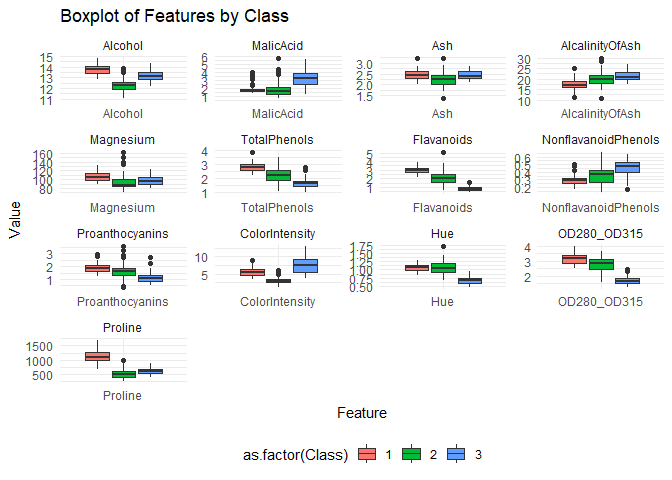

\[MA-589\] Final Project
================
Wine Statisticians - Eugene Pirono, Lance Yoon, Jason Zhu
2024-04-21

# Expectation Maximization Clustering of different Wine Types

## Introduction

Wine, a beverage celebrated for its rich diversity and intricate
flavors, serves as a fascinating subject for exploratory data analysis
and clustering due to the complex interplay of its attributes. Each
variety of wine carries a unique signature, a profile crafted by its
chemical makeup, which can be decoded using data analysis. Wine is a
perfect blend of art and science, making it an exemplary candidate to
apply and illustrate computational statistics.

## Project Overview

The project starts with an exhaustive exploratory data analysis (EDA) to
sift through the multitude of features inherent in wine data. This
pivotal phase involves a keen examination of the relationships between
various chemical properties, facilitated by statistical visualizations
to discern the most informative attributes. This allows us to distill
the essence of the dataset, cherry-picking the features that capture the
essence of wine classes most effectively. Following the EDA, we embark
on the preprocessing stage, standardizing the selected features to
establish a level playing field, thereby priming the data for
clustering. The K-Means algorithm, invoked from an R library, sets the
stage as our baseline model. This widely regarded partitioning technique
provides a robust starting point to gauge the clusters’ cohesion and
separation before delving into other methods.

As the next step in our analytical journey, we put forth our custom
implementation of the Expectation Maximization (EM) algorithm. This
self-crafted algorithm, grounded in probability theory and linear
algebra, serves as a testament to our understanding of the underlying
statistical framework. The rigor of our EM algorithm will be evaluated
against the baseline model through a suite of metrics. These comparative
metrics are meticulously chosen not only to quantify the performance of
each model but also to illuminate the nuances between the baseline
K-Means clustering and our probabilistic EM approach. Through this
meticulous comparative analysis, we aim to uncover the subtleties and
strengths each method brings to the art of unsupervised learning in the
context of wine categorization. The goal of this project is to create
and test our own EM-GMM model and to see the differences in terms of
result and difficulty.

``` r
df <- read.csv('data/wine_data.csv')
head(df)
```

    ##   Class Alcohol MalicAcid  Ash AlcalinityOfAsh Magnesium TotalPhenols
    ## 1     1   14.23      1.71 2.43            15.6       127         2.80
    ## 2     1   13.20      1.78 2.14            11.2       100         2.65
    ## 3     1   13.16      2.36 2.67            18.6       101         2.80
    ## 4     1   14.37      1.95 2.50            16.8       113         3.85
    ## 5     1   13.24      2.59 2.87            21.0       118         2.80
    ## 6     1   14.20      1.76 2.45            15.2       112         3.27
    ##   Flavanoids NonflavanoidPhenols Proanthocyanins ColorIntensity  Hue
    ## 1       3.06                0.28            2.29           5.64 1.04
    ## 2       2.76                0.26            1.28           4.38 1.05
    ## 3       3.24                0.30            2.81           5.68 1.03
    ## 4       3.49                0.24            2.18           7.80 0.86
    ## 5       2.69                0.39            1.82           4.32 1.04
    ## 6       3.39                0.34            1.97           6.75 1.05
    ##   OD280_OD315 Proline
    ## 1        3.92    1065
    ## 2        3.40    1050
    ## 3        3.17    1185
    ## 4        3.45    1480
    ## 5        2.93     735
    ## 6        2.85    1450

## Exploratory Data Analysis

    ## 
    ## Attaching package: 'dplyr'

    ## The following objects are masked from 'package:stats':
    ## 
    ##     filter, lag

    ## The following objects are masked from 'package:base':
    ## 
    ##     intersect, setdiff, setequal, union

    ## Registered S3 method overwritten by 'GGally':
    ##   method from   
    ##   +.gg   ggplot2

    ## corrplot 0.92 loaded

    ## 
    ## Attaching package: 'gplots'

    ## The following object is masked from 'package:stats':
    ## 
    ##     lowess

    ## 
    ## Attaching package: 'gridExtra'

    ## The following object is masked from 'package:dplyr':
    ## 
    ##     combine

    ## Package 'mclust' version 6.1
    ## Type 'citation("mclust")' for citing this R package in publications.

    ## 
    ## Attaching package: 'mvtnorm'

    ## The following object is masked from 'package:mclust':
    ## 
    ##     dmvnorm

``` r
sum(is.na(df))
```

    ## [1] 0

``` r
cor_matrix <- cor(df[, -1]) #First column is 'class'
cor_matrix_rounded <- round(cor_matrix, 2)
corrplot(cor_matrix_rounded, method = "circle")
```

<!-- -->

<!-- -->

## Feature Selection

In the pursuit of effective clustering in wine datasets, the selection
of variables is paramount. The aim is to choose features that are
minimally correlated to each other to avoid bias in the clustering
algorithm. Highly correlated variables can distort the real distribution
and inter-relationships in the data, leading to misleading cluster
formations. Based on an in-depth analysis of domain knowledge about wine
and a detailed examination of the heatmap correlations, a strategic
decision was made on which variables to include in the clustering
process.

The reasoning behind the chosen variables and the decisions made are
summarized in the table below:

| Considerations                  | Reasoning                                                                                                                                                                                                  | Decision                                                                                                        |
|---------------------------------|------------------------------------------------------------------------------------------------------------------------------------------------------------------------------------------------------------|-----------------------------------------------------------------------------------------------------------------|
| **Alcohol vs Proline**          | Alcohol is pivotal in defining the flavor, preservation, and fermentation of wine. Proline, though important as an amino acid related to wine quality, shows a high correlation with Alcohol (0.64372004). | Choose **Alcohol** over Proline because it is more indicative of the wine type and is a primary characteristic. |
| **Malic Acid vs Hue**           | Malic Acid plays a significant role in wine but undergoes transformations during winemaking and is strongly negatively correlated with Hue (-0.56129569), a direct indicator of wine age and quality.      | Use **Hue** as it provides a direct visual representation of wine characteristics that Malic Acid does not.     |
| **Total Phenols vs Flavonoids** | Total Phenols, encompassing Flavonoids, are crucial for their impact on the wine’s bitterness, astringency, and color, with a strong correlation between them (0.8645635).                                 | Use **Total Phenols** as they cover a broader range of wine characteristics than Flavonoids alone.              |
| **Color Intensity**             | Color Intensity is less correlated with other features and provides insight into the wine’s age, grape type, and concentration.                                                                            | Include **Color Intensity** because it captures aspects of wine not represented by the other selected features. |
| **Ash**                         | Ash shows moderate correlations with several attributes and may not provide unique information for clustering.                                                                                             | Exclude **Ash** due to its less distinctive role in differentiation.                                            |
| **Magnesium**                   | Important for grapevine health and wine quality, Magnesium, however, correlates with other features and is not considered a primary characteristic for differentiation.                                    | Exclude **Magnesium** as it does not offer primary distinguishing characteristics.                              |

This selection process ensures that the clustering analysis is based on
features that provide unique and relevant information about the wines,
potentially leading to more distinct and meaningful clusters. The
choices are informed by both statistical analysis and substantive wine
knowledge, reflecting a balanced approach that leverages data-driven
insights and domain expertise.

``` r
df_selected_features <- df[, c('Class', 'Alcohol', 'Hue', 'TotalPhenols', 'ColorIntensity')]
head(df_selected_features)
```

    ##   Class Alcohol  Hue TotalPhenols ColorIntensity
    ## 1     1   14.23 1.04         2.80           5.64
    ## 2     1   13.20 1.05         2.65           4.38
    ## 3     1   13.16 1.03         2.80           5.68
    ## 4     1   14.37 0.86         3.85           7.80
    ## 5     1   13.24 1.04         2.80           4.32
    ## 6     1   14.20 1.05         3.27           6.75

``` r
df_melted <- melt(df_selected_features, id.vars = "Class")

p <- ggplot(df_melted, aes(x = variable, y = value, group = interaction(variable, Class))) +
  geom_boxplot(aes(fill = as.factor(Class))) +
  facet_wrap(~variable, scales = 'free', ncol = ) +
  labs(title = "Boxplot of Selected Features by Class", y = "Value", x = "Feature") +
  theme_minimal() +
  theme(legend.position = "bottom") 

print(p)
```

<!-- -->

## Feature Standardization

Standardization is a critical preprocessing step in clustering analysis,
particularly because most clustering algorithms, such as K-Means are
based on measuring distances between data points. When features within a
dataset vary widely in magnitudes, units, and range, algorithms that
rely on Euclidean distance can be biased towards variables with larger
scales. By standardizing the data (i.e., scaling each feature to have
zero mean and unit variance), we ensure that each feature contributes
equally to the distance computations. This prevents features with larger
ranges from dominating the decision on how data points are clustered and
allows the algorithm to identify more meaningful patterns in the data.
Moreover, standardization can improve the convergence behavior of
clustering algorithms, leading to more stable and interpretable cluster
assignments.

``` r
features_to_scale <- df_selected_features[, -1] 
scaled_features <- scale(features_to_scale)
df_scaled <- data.frame(Class = df_selected_features$Class, scaled_features)
summary(df_scaled)
```

    ##      Class          Alcohol              Hue            TotalPhenols     
    ##  Min.   :1.000   Min.   :-2.42739   Min.   :-2.08884   Min.   :-2.10132  
    ##  1st Qu.:1.000   1st Qu.:-0.78603   1st Qu.:-0.76540   1st Qu.:-0.88298  
    ##  Median :2.000   Median : 0.06083   Median : 0.03303   Median : 0.09569  
    ##  Mean   :1.938   Mean   : 0.00000   Mean   : 0.00000   Mean   : 0.00000  
    ##  3rd Qu.:3.000   3rd Qu.: 0.83378   3rd Qu.: 0.71116   3rd Qu.: 0.80672  
    ##  Max.   :3.000   Max.   : 2.25341   Max.   : 3.29241   Max.   : 2.53237  
    ##  ColorIntensity   
    ##  Min.   :-1.6297  
    ##  1st Qu.:-0.7929  
    ##  Median :-0.1588  
    ##  Mean   : 0.0000  
    ##  3rd Qu.: 0.4926  
    ##  Max.   : 3.4258

``` r
head(df_scaled)
```

    ##   Class   Alcohol        Hue TotalPhenols ColorIntensity
    ## 1     1 1.5143408  0.3611585    0.8067217      0.2510088
    ## 2     1 0.2455968  0.4049085    0.5670481     -0.2924962
    ## 3     1 0.1963252  0.3174085    0.8067217      0.2682629
    ## 4     1 1.6867914 -0.4263410    2.4844372      1.1827317
    ## 5     1 0.2948684  0.3611585    0.8067217     -0.3183774
    ## 6     1 1.4773871  0.4049085    1.5576991      0.7298108

## Baseline Algorithm - K Means Clustering

``` r
features <- df_scaled[, -1]
set.seed(589) 
kmeans_result <- kmeans(features, centers = 3, nstart = 25) 

actual_labels <- df_scaled$Class
predicted_labels <- kmeans_result$cluster
ari_value <- adjustedRandIndex(actual_labels, predicted_labels)
print(paste("Adjusted Rand Index:", ari_value))
```

    ## [1] "Adjusted Rand Index: 0.753270037486692"

``` r
sil_widths <- silhouette(predicted_labels, dist(features))
avg_silhouette_score <- mean(sil_widths[, "sil_width"])
print(paste("Average Silhouette Score:", avg_silhouette_score))
```

    ## [1] "Average Silhouette Score: 0.383979047272604"

``` r
pca_result <- prcomp(features)
df_pca <- as.data.frame(pca_result$x)
df_pca$cluster <- kmeans_result$cluster
df_pca$class <- actual_labels


ggplot(df_pca, aes(x = PC1, y = PC2)) + 
  geom_point(aes(color = as.factor(class)), size = 3, alpha = 0.6) +
  geom_point(aes(shape = as.factor(cluster)), size = 3, alpha = 0.6) +
  stat_ellipse(aes(fill = as.factor(cluster)), geom = "polygon", alpha = 0.2, show.legend = FALSE) +
  scale_color_manual(values = c("#1b9e77", "#d95f02", "#7570b3")) +
  scale_shape_manual(values = c(16, 17, 18)) +
  geom_label_repel(aes(label = ifelse(df_pca$class == df_pca$cluster, as.character(df_pca$class), paste("Class", df_pca$class, "\nCluster", df_pca$cluster))),
                   box.padding   = 0.35, 
                   point.padding = 0.5,
                   segment.color = 'grey50') +
  labs(title = 'Comparison of Actual Classes and K-Means Clusters (PCA-transformed)',
       color = "True Class",
       shape = "K-Means Cluster",
       x = 'PC1', 
       y = 'PC2') +
  theme_minimal() +
  theme(legend.position = "right", legend.title = element_blank())
```

<!-- -->

### Adjusted Rand Index (ARI)

- **High ARI Score (0.753)**: This score suggests a strong agreement
  between the clustering assignments and the true classifications of the
  wines. The ARI, being a measure of the similarity between two data
  clusterings adjusted for chance, indicates that the clusters generated
  by the K-Means algorithm align well with the actual, underlying
  groupings within the wine data. This high score implies that the
  K-Means algorithm is effective in distinguishing between different
  types of wine based on their features.

### Average Silhouette Score

- **Lower Average Silhouette Score (0.383)**: While this score is not
  exceptionally low, it is not particularly high either, suggesting
  moderate separation between the clusters. In the context of wine, this
  score implies that while the wines are grouped into distinct
  categories to some extent, there remains considerable overlap or
  closeness between these groups. This could be due to the inherent
  similarities among different types of wines, where distinguishing
  based on the analyzed features alone does not achieve clear
  separation.

### Interpretation of Clustering Performance

#### Cluster Distribution and Overlap

The high ARI combined with a lower silhouette score might indicate that
the true class boundaries are not perfectly separable by the spherical
clusters assumed by K-Means. This situation could be common in wine data
where different wine varieties (classes) may share overlapping taste
profiles, chemical compositions, or production methods.

#### Cluster Density and Size Variance

The variance in cluster densities or sizes can also influence the
silhouette score. For example, if a particular type of wine forms a very
dense cluster while others are more spread out, the average distance
within clusters compared to between clusters may decrease, leading to a
lower silhouette score.

#### Noise and Outliers

Noise and outliers in wine data, such as unusual wines or misrecorded
data points, can disproportionately affect the silhouette score more
than the ARI. This could skew the average distance calculations,
impacting the clarity of cluster boundaries.

## EM Algorithm - Gaussian Mixture Model

``` r
# EM Algorithm Function
EM_GMM <- function(features, k, max_iterations = 100, tolerance = 1e-6) {
  n <- nrow(features)
  d <- ncol(features)
  
  # Initialize parameters
  set.seed(589)
  means <- kmeans(features, centers = k, nstart = 5)$centers
  covariances <- array(rep(diag(d), k), dim = c(d, d, k))
  mixing_coefficients <- rep(1/k, k)
  
  log_likelihood_old <- -Inf
  
  # Main EM loop
  for (iteration in 1:max_iterations) {
    # E-step: Calculate responsibilities
    responsibilities <- matrix(0, nrow = n, ncol = k)
    for (j in 1:k) {
      responsibilities[, j] <- mixing_coefficients[j] * dmvnorm(features, mean = means[j, ], sigma = covariances[, , j])
    }
    responsibilities <- sweep(responsibilities, 1, rowSums(responsibilities), FUN = "/")
    
    # M-step: Update parameters
    sums_of_responsibilities <- colSums(responsibilities)
    for (j in 1:k) {
      means[j, ] <- (t(responsibilities[, j]) %*% features) / sums_of_responsibilities[j]
      centered <- sweep(features, 1, means[j, ], FUN = "-")
      covariances[, , j] <- t(centered) %*% (centered * responsibilities[, j]) / sums_of_responsibilities[j]
    }
    mixing_coefficients <- sums_of_responsibilities / n
    
    # Check for convergence via log likelihood
    log_likelihood_new <- sum(log(rowSums(responsibilities * mixing_coefficients)))
    if (abs(log_likelihood_new - log_likelihood_old) < tolerance) {
      cat("Converged after", iteration, "iterations.\n")
      break
    }
    log_likelihood_old = log_likelihood_new
  }
  
  list(means = means, covariances = covariances, mixing_coefficients = mixing_coefficients)
}

features <- as.matrix(df_scaled[, -ncol(df_scaled)])
result <- EM_GMM(features, k = 3)
print(result)
```

    ## $means
    ##      Class     Alcohol         Hue TotalPhenols
    ## 1 1.896862 -0.08501828  0.07676566    0.1042218
    ## 2 2.058845  0.24816352 -0.22402891   -0.3041360
    ## 3 2.493043 -0.14046875 -0.90672234   -1.6732408
    ## 
    ## $covariances
    ## , , 1
    ## 
    ##            [,1]        [,2]        [,3]       [,4]
    ## [1,]  3.1077867 -1.25666540 -0.27004065 -1.1646002
    ## [2,] -1.2566654  1.98239135  0.03817078  1.0280340
    ## [3,] -0.2700407  0.03817078  1.91537073  0.4290612
    ## [4,] -1.1646002  1.02803403  0.42906125  1.6865855
    ## 
    ## , , 2
    ## 
    ##            [,1]      [,2]       [,3]       [,4]
    ## [1,]  4.3948103 -1.053043 -0.9124872 -2.3967513
    ## [2,] -1.0530434  1.644567 -0.3915240  1.6315225
    ## [3,] -0.9124872 -0.391524  2.2300536  0.5426161
    ## [4,] -2.3967513  1.631523  0.5426161  2.4510925
    ## 
    ## , , 3
    ## 
    ##             [,1]       [,2]       [,3]        [,4]
    ## [1,]  11.8083542 -8.5807760 -0.3455579 -14.0445718
    ## [2,]  -8.5807760  7.4906476 -0.5150423  11.1505339
    ## [3,]  -0.3455579 -0.5150423  0.4777335  -0.1656422
    ## [4,] -14.0445718 11.1505339 -0.1656422  17.4153512
    ## 
    ## 
    ## $mixing_coefficients
    ## [1] 7.448160e-01 2.551727e-01 1.127947e-05

## Expectation-Maximization Algorithm for GMM

The Expectation-Maximization (EM) algorithm is a statistical method for
finding maximum likelihood estimates in models with latent variables. In
the context of clustering, the EM algorithm for Gaussian Mixture Models
(GMMs) can be used to identify clusters that are not necessarily
spherical, as is the case with K-Means.

### The EM Algorithm for GMM

The EM algorithm involves two steps: the Expectation step (E-step) and
the Maximization step (M-step). These steps are iterated until
convergence.

#### Mathematical Notation

Let’s denote:

- $\mathbf{X}$ as the dataset with $n$ observations and $d$ features.
- $k$ as the number of clusters.
- $\boldsymbol{\mu}_j$ as the mean of the $j$-th cluster.
- $\boldsymbol{\Sigma}_j$ as the covariance matrix of the $j$-th
  cluster.
- $\pi_j$ as the mixing coefficient for the $j$-th cluster.
- $\gamma_{ij}$ as the responsibility, which is the probability that the
  $i$-th observation belongs to the $j$-th cluster.

The algorithm proceeds as follows:

**Initialization:**

1.  Initialize $\boldsymbol{\mu}_j$, $\boldsymbol{\Sigma}_j$, and
    $\pi_j$ with reasonable values. In this case, K-Means is used for
    initialization.

**EM Steps:**

Repeat until the log-likelihood converges:

**E-step:**

For each $i$ in $1, \ldots, n$ and each $j$ in $1, \ldots, k$:

$$
\gamma_{ij} \leftarrow \frac{\pi_j \mathcal{N}(\mathbf{x}_i \,|\, \boldsymbol{\mu}_j, \boldsymbol{\Sigma}_j)}{\sum_{l=1}^{k} \pi_l \mathcal{N}(\mathbf{x}_i \,|\, \boldsymbol{\mu}_l, \boldsymbol{\Sigma}_l)}
$$

**M-step:**

For each $j$ in $1, \ldots, k$:

- Update $\boldsymbol{\mu}_j$:

$$
\boldsymbol{\mu}_j \leftarrow \frac{\sum_{i=1}^{n} \gamma_{ij} \mathbf{x}_i}{\sum_{i=1}^{n} \gamma_{ij}}
$$

- Update $\boldsymbol{\Sigma}_j$:

$$
\boldsymbol{\Sigma}_j \leftarrow \frac{\sum_{i=1}^{n} \gamma_{ij} (\mathbf{x}_i - \boldsymbol{\mu}_j)(\mathbf{x}_i - \boldsymbol{\mu}_j)^T}{\sum_{i=1}^{n} \gamma_{ij}}
$$

- Update $\pi_j$:

$$
\pi_j \leftarrow \frac{\sum_{i=1}^{n} \gamma_{ij}}{n}
$$

The log-likelihood is computed at each iteration and the convergence is
checked based on the difference in log-likelihood between consecutive
iterations.

### EM-GMM Result Interpretation

- The `means` represent the centroids of the Gaussian Distributions,
  assumed for each 3 clusters we have. For example, the first cluster
  has negative values for alcohol, but positive values for `Hue` and
  `TotalPhenols`. So this suggests that wines in this cluster tend to
  have lower alcohol levels but higher hue and total phenols.
- The `covariances` matrices represent the shape of the cluster in the
  feature space. Unlike K-Means which assumes spherical clusters, EM
  allows for elliptical shapes. For example, the high covariances, 11.15
  and 17.4 implies that data points are spread out along these features.
- The `mixing_coefficients` represent the relative sizes of each cluster
  (In terms of the probability of a point belonging to the cluster)
  before considering the data points. A higher value means the cluster
  is larger relative to the others. In our case, we see that the first
  cluster has the highest proportions of points, then the second
  cluster, and lastly the third cluster has a very small proportion.

### Comparative Analysis

- **Capability to Model Complex Structures**:
  - **GMM**: The Gaussian Mixture Model’s ability to account for
    covariances within each cluster allows it to capture more complex,
    elliptical cluster shapes. This is particularly advantageous for
    datasets like wines, where the relationships between features (e.g.,
    alcohol content and phenolic levels) can significantly influence
    clustering outcomes.
  - **KMeans**: This algorithm assumes that all clusters are spherical
    and of similar sizes, which might not adequately represent the
    underlying distributions if the actual clusters vary in shape or
    scale.
- **Performance Metrics**:
  - The high Adjusted Rand Index (ARI) for KMeans suggests that it
    performs well in aligning with the true classifications of wines,
    indicating effective clustering. However, the Gaussian Mixture
    Model, with its detailed probabilistic approach to modeling data
    distributions (including outlier identification as reflected by the
    mixing coefficients), may provide deeper insights, especially useful
    for understanding subtle differences and rare types of wines.
- **Handling of Outliers**:
  - **GMM**: Demonstrates effective identification and isolation of
    outliers or rare data points, as evidenced by the very small mixing
    coefficient for one of the clusters. This feature is critical in
    datasets where identifying outliers is valuable, such as in wine
    quality assessment or anomaly detection.
  - **KMeans**: Less effective at handling outliers, as it does not
    model probability densities or accommodate varying variances within
    the data.

### Improvements

For further improvement to clustering wine type, we could improve on
integrating insights from both models, where we can use GMM to parse
complex and subtle data patterns and KMeans for a broader overview of
classifications. This combined strategy could exploit the strengths of
both algorithms, offering a holistic clustering methodology suitable for
detailed and nuanced analysis of wine datasets.

### Conclusion

In the context of wine data, characterized by complex relationships
between variables, the Gaussian Mixture Model (GMM) potentially offers a
more nuanced and informative clustering solution compared to KMeans.
Also provided the extensive library in R, it is easier to implemenent
KMeans compared to GMM. GMM’s detailed probabilistic modeling may
uncover subtle distinctions and outlier groups that KMeans might
otherwise amalgamate into more generalized clusters. However, KMeans
provides robust, straightforward insights that align well with general
classifications, as evidenced by the high ARI.
