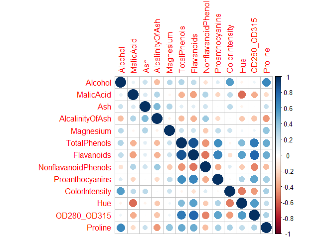

\[MA-589\] Final Project
================
Wine Statisticians - Eugene Pirono, Lance, Jason Zhu
2024-04-21

# Expectation Maximization Clustering of different Wine Types

## Introduction

Wine, a beverage celebrated for its rich diversity and intricate
flavors, serves as a fascinating subject for exploratory data analysis
and clustering due to the complex interplay of its attributes. Each
variety of wine carries a unique signature, a profile crafted by its
chemical makeup, which can be decoded using data analysis. The selection
of wine as the focus of our investigation is intentional; it is a
perfect blend of art and science, making it an exemplary candidate to
apply and illustrate machine learning techniques. By dissecting the
constituents of wine through computational lenses, we aspire to
demonstrate the potent capabilities of unsupervised learning in pattern
recognition and categorization.

## Project Overview

The project unfolds methodically, commencing with an exhaustive
exploratory data analysis (EDA) to sift through the multitude of
features inherent in wine data. This pivotal phase involves a keen
examination of the relationships between various chemical properties,
facilitated by statistical visualizations to discern the most
informative attributes. Such scrutiny allows us to distill the essence
of the dataset, cherry-picking the features that capture the essence of
wine classes most effectively. Following the EDA, we embark on the
preprocessing stage, standardizing the selected features to establish a
level playing field, thereby priming the data for clustering. The
K-Means algorithm, invoked from an R library, sets the stage as our
baseline model. This widely regarded partitioning technique provides a
robust starting point to gauge the clusters’ cohesion and separation
before delving into more sophisticated methods.

As the next step in our analytical journey, we put forth our custom
implementation of the Expectation Maximization (EM) algorithm. This
self-crafted algorithm, grounded in probability theory and linear
algebra, serves as a testament to our understanding of the underlying
statistical framework. The rigor of our EM algorithm will be evaluated
against the baseline model through a suite of metrics. These comparative
metrics are meticulously chosen not only to quantify the performance of
each model but also to illuminate the nuances between the baseline
K-Means clustering and our probabilistic EM approach. Through this
meticulous comparative analysis, we aim to uncover the subtleties and
strengths each method brings to the art of unsupervised learning in the
context of wine categorization.

``` r
df <- read.csv('data/wine_data.csv')
head(df)
```

    ##   Class Alcohol MalicAcid  Ash AlcalinityOfAsh Magnesium TotalPhenols
    ## 1     1   14.23      1.71 2.43            15.6       127         2.80
    ## 2     1   13.20      1.78 2.14            11.2       100         2.65
    ## 3     1   13.16      2.36 2.67            18.6       101         2.80
    ## 4     1   14.37      1.95 2.50            16.8       113         3.85
    ## 5     1   13.24      2.59 2.87            21.0       118         2.80
    ## 6     1   14.20      1.76 2.45            15.2       112         3.27
    ##   Flavanoids NonflavanoidPhenols Proanthocyanins ColorIntensity  Hue
    ## 1       3.06                0.28            2.29           5.64 1.04
    ## 2       2.76                0.26            1.28           4.38 1.05
    ## 3       3.24                0.30            2.81           5.68 1.03
    ## 4       3.49                0.24            2.18           7.80 0.86
    ## 5       2.69                0.39            1.82           4.32 1.04
    ## 6       3.39                0.34            1.97           6.75 1.05
    ##   OD280_OD315 Proline
    ## 1        3.92    1065
    ## 2        3.40    1050
    ## 3        3.17    1185
    ## 4        3.45    1480
    ## 5        2.93     735
    ## 6        2.85    1450

## Exploratory Data Analysis

    ## 
    ## Attaching package: 'dplyr'

    ## The following objects are masked from 'package:stats':
    ## 
    ##     filter, lag

    ## The following objects are masked from 'package:base':
    ## 
    ##     intersect, setdiff, setequal, union

    ## Registered S3 method overwritten by 'GGally':
    ##   method from   
    ##   +.gg   ggplot2

    ## corrplot 0.92 loaded

    ## 
    ## Attaching package: 'gplots'

    ## The following object is masked from 'package:stats':
    ## 
    ##     lowess

``` r
sum(is.na(df))
```

    ## [1] 0

``` r
cor_matrix <- cor(df[, -1]) #First column is 'class'
cor_matrix_rounded <- round(cor_matrix, 2)
corrplot(cor_matrix_rounded, method = "circle")
```

<!-- -->

<!-- -->

## Feature Selection

In the pursuit of effective clustering in wine datasets, the selection
of variables is paramount. The aim is to choose features that are
minimally correlated to each other to avoid bias in the clustering
algorithm. Highly correlated variables can distort the real distribution
and inter-relationships in the data, leading to misleading cluster
formations. Based on an in-depth analysis of domain knowledge about wine
and a detailed examination of the heatmap correlations, a strategic
decision was made on which variables to include in the clustering
process.

The reasoning behind the chosen variables and the decisions made are
summarized in the table below:

| Considerations                  | Reasoning                                                                                                                                                                                                  | Decision                                                                                                        |
|---------------------------------|------------------------------------------------------------------------------------------------------------------------------------------------------------------------------------------------------------|-----------------------------------------------------------------------------------------------------------------|
| **Alcohol vs Proline**          | Alcohol is pivotal in defining the flavor, preservation, and fermentation of wine. Proline, though important as an amino acid related to wine quality, shows a high correlation with Alcohol (0.64372004). | Choose **Alcohol** over Proline because it is more indicative of the wine type and is a primary characteristic. |
| **Malic Acid vs Hue**           | Malic Acid plays a significant role in wine but undergoes transformations during winemaking and is strongly negatively correlated with Hue (-0.56129569), a direct indicator of wine age and quality.      | Use **Hue** as it provides a direct visual representation of wine characteristics that Malic Acid does not.     |
| **Total Phenols vs Flavonoids** | Total Phenols, encompassing Flavonoids, are crucial for their impact on the wine’s bitterness, astringency, and color, with a strong correlation between them (0.8645635).                                 | Use **Total Phenols** as they cover a broader range of wine characteristics than Flavonoids alone.              |
| **Color Intensity**             | Color Intensity is less correlated with other features and provides insight into the wine’s age, grape type, and concentration.                                                                            | Include **Color Intensity** because it captures aspects of wine not represented by the other selected features. |
| **Ash**                         | Ash shows moderate correlations with several attributes and may not provide unique information for clustering.                                                                                             | Exclude **Ash** due to its less distinctive role in differentiation.                                            |
| **Magnesium**                   | Important for grapevine health and wine quality, Magnesium, however, correlates with other features and is not considered a primary characteristic for differentiation.                                    | Exclude **Magnesium** as it does not offer primary distinguishing characteristics.                              |

This selection process ensures that the clustering analysis is based on
features that provide unique and relevant information about the wines,
potentially leading to more distinct and meaningful clusters. The
choices are informed by both statistical analysis and substantive wine
knowledge, reflecting a balanced approach that leverages data-driven
insights and domain expertise.

``` r
df_selected_features <- df[, c('Class', 'Alcohol', 'Hue', 'TotalPhenols', 'ColorIntensity')]
head(df_selected_features)
```

    ##   Class Alcohol  Hue TotalPhenols ColorIntensity
    ## 1     1   14.23 1.04         2.80           5.64
    ## 2     1   13.20 1.05         2.65           4.38
    ## 3     1   13.16 1.03         2.80           5.68
    ## 4     1   14.37 0.86         3.85           7.80
    ## 5     1   13.24 1.04         2.80           4.32
    ## 6     1   14.20 1.05         3.27           6.75

``` r
df_melted <- melt(df_selected_features, id.vars = "Class")

p <- ggplot(df_melted, aes(x = variable, y = value, group = interaction(variable, Class))) +
  geom_boxplot(aes(fill = as.factor(Class))) +
  facet_wrap(~variable, scales = 'free', ncol = ) +
  labs(title = "Boxplot of Selected Features by Class", y = "Value", x = "Feature") +
  theme_minimal() +
  theme(legend.position = "bottom") 

print(p)
```

<!-- -->

NEXT STEPS: - Modelling (K_means_clustering) as our baseline, add some
plots and show metrics - Create our own EM algorithm, add the
mathematics behind it, explain why we did that. Explain our EM
algorithm, show metrics and visualization, compare silhouette score or
other metrics. - Comparison of result, which algorithm did better in
what sense, compare the metrics and discuss - What can be improve next
time? What we did well? - Conclusion and learnings,
